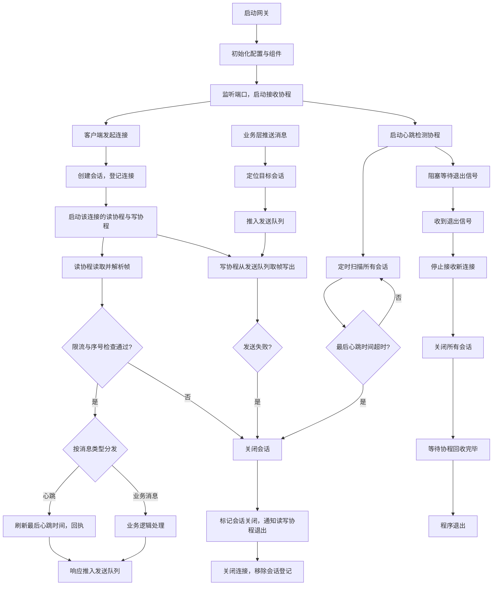

> 这是 SignalDrift 系列开发日志的第二篇。上一篇讲玩法重构，这一篇按约定讲网关——纯后端、纯网络、纯并发，是这个项目真正的主菜。我给自己定的规矩是先写清楚为什么，再写怎么做的。

## 为什么第一份计划是网关

SignalDrift 的服务端拆成了三层：**网关 → 大厅 → 房间**。网关是最底下的一层，也是所有玩家消息必经的一层——心跳、登录、匹配、战斗，全部从它这里进出。它不关心业务，只关心四件事：**连接、协议、会话、生存**。

我给它定的约束也很硬：

- **零第三方依赖**，全部用 Go 标准库——网关这种基础层，依赖越少越干净；
- **所有阈值从配置文件读**（端口、并发上限、限流速率、心跳间隔），代码里不写死任何一个数字；
- **每完成一个任务必须测试全绿才提交**，关键任务要跑竞态检测。

这一篇就按"从协议到进程"的顺序，讲这四件事各自是怎么想的、怎么做的。

## 传输层：为什么是 TCP

设计帧格式之前，先回答一个更基础的问题：为什么把网关建在 TCP 上，而不是 UDP 或 WebSocket？

| 方案 | 优点 | 代价 | 结论 |
|---|---|---|---|
| TCP | 可靠、有序、内置拥塞控制 | 队头阻塞、延迟略高 | **选用**：玩法对延迟不敏感 |
| UDP | 低延迟、无队头阻塞 | 丢包乱序，可靠传输要自己实现 | 否：等于重写一遍 TCP |
| WebSocket | 浏览器可用 | 握手开销、帧格式冗余、面向通用场景 | 否：自研客户端不需要 |

逐个说：

- **为什么不 UDP**。UDP 不保证送达和顺序，实时对战游戏常用它换低延迟——但"丢包重算"的前提是每帧状态可重算、延迟能压到几十毫秒。我们的对战是 1v1 涂色：一局 3 分钟，操作频率低，一局下来也就几十条指令——省下的几毫秒没有意义，反而要背上丢包重算、重传的复杂度。选 UDP 还得自己实现序号、ACK、重传、拥塞控制——那不是选型，是重写 TCP。
- **为什么不 WebSocket**。WebSocket 是"给浏览器用的 TCP 封装"——它解决的是浏览器没有裸 socket 的问题。我们的客户端是 Unity 自研，没有这个约束；它的帧格式（掩码、分片、压缩协商）为通用场景设计，对定长二进制协议是纯冗余；HTTP 升级握手也是白付的开销。
- **为什么 TCP（正面说）**。TCP 给我们的恰好是协议层想要的：可靠的字节流 + 现成的拥塞控制。它不解决"消息边界"——字节流没有边界，把流切成帧正是下一节要做的事。**传输层负责把字节可靠送到，协议层负责让字节有意义**，TCP 把前一半做完了，我们专心做后一半。

## 协议：12 字节的帧头

### 为什么自研，不直接用现成的

选型时认真想过 gRPC/Protobuf 这类成熟方案，最后决定自己写协议，三个理由：

1. **零依赖约束**。项目规定服务端全部标准库，Protobuf 直接出局；
2. **学习价值**。写一遍协议栈，才真正理解"消息边界"、"字节序"、"粘包分包"这些词在说什么——这是网络编程的第一课，我不想跳过；
3. **展示面**。客户端（Unity）要按同一份规范实现编解码，自研协议意味着**这份契约是我自己定义的**——从帧格式到消息号分配，整个协议栈都在我的掌控里，这对求职作品是实打实的展示。

### 帧格式

```
┌────────┬────────┬──────────────┬──────────────┬─────────┐
│ magic  │ msgID  │     seq      │   bodyLen    │  body   │
│ 2 字节 │ 2 字节 │   4 字节     │   4 字节     │ ≤64KB   │
└────────┴────────┴──────────────┴──────────────┴─────────┘
  0x5344   消息号    序号/幂等      body 长度      消息体
```

设计时几个决定的理由：

- **magic 固定 `0x5344`**（"SD"）。它是第一道防线：解析时先校验魔数，不是 `0x5344` 的字节流直接拒绝。防止把垃圾数据或误连的其他流量当协议解析；
- **body 上限 64KB**。单帧消息体封顶，防恶意超长帧占内存。实际业务消息（登录、匹配、战斗指令）都在几十字节到几 KB，64KB 余量充足；
- **大端序（网络字节序）**。Go 的 `encoding/binary` 一行搞定，Unity 端 C# 同样有大端转换的现成 API。字节序是协议最容易踩的坑，我在测试里专门用非对称值（比如 seq=42）验证——发送端按大端写出 `00 00 00 2A`，接收端若错误地按小端解析，读出来是 `0x2A000000`（七亿多），一眼就能看出错；
- **seq 字段单独占 4 字节**。它不只是序号，还是幂等过滤的凭据（后面会话一节讲）。

### 消息号分区

消息号按号段划分，一个数字就能看出它归哪层管：

| 号段 | 归属 | 例子 |
|---|---|---|
| 1 - 99 | 网关层 | 心跳(1)、心跳应答(2) |
| 100 - 199 | 测试/通用 | Echo(100) |
| 200 - 299 | 大厅 | 登录、匹配（后续计划） |
| 300 - 399 | 房间 | 战斗消息（后续计划） |

分区的价值：新增消息时不会撞号，出问题时看消息号就知道该查哪层。

## 粘包与分包：TCP 的流本质

TCP 是**字节流**，没有消息边界。客户端发一帧，服务端可能一次只读到半帧（**拆包**），也可能一次读到好几帧（**粘包**）。处理不好，解析就会错位。

我的 `FrameReader` 只有两个动作：

- **读头用 `io.ReadFull`**：一次 `Read` 可能只回来 3 个字节，`ReadFull` 会坚持读到 12 字节的帧头凑齐为止——天然处理拆包；
- **循环调用 `Next()`**：一帧读完后继续读下一帧——天然处理粘包。

这部分我写了四组测试，其中一组特别刁钻：用 `iotest.OneByteReader` 模拟"**每次只给 1 字节**"的最坏情况——一帧 15 字节要分 15 次读进来，测试照样必须通过。这种极端拆包在真实网络里几乎不会出现，但测试的意义就是**把实现的可靠性逼到极限**。

## 会话：每连接一读一写两个协程

### 为什么是两个协程，不是一个

一条连接对应一个会话（Session）。如果读写共用一个协程，读阻塞时写也卡住——服务端想回个消息，却要等客户端先发数据过来，这是不可接受的。所以：

- **读协程**：`Read` → 解析帧 → 限流 → 幂等检查 → 路由分发；
- **写协程**：从一个 channel 里取编码好的帧 → 写 socket。

两个协程之间用一个有缓冲的 channel 接力。这带来一个非常干净的纪律：**handler 永不碰网络**——业务代码只做"更新状态 + 把响应帧投进队列"两件事，毫秒级返回，读协程立刻回去读下一帧。慢客户端只会堵住自己的写协程，不影响别人。

### seq 幂等：重复帧静默丢弃

客户端可能因超时重发请求（没等到应答），也可能是 bug 导致重复发包。如果服务端把重复帧当新消息处理，登录、匹配这类有副作用的操作会被执行两遍。所以每个会话维护一个严格递增的 seq 检查：**新帧的 seq 必须大于上一次**，重复或回退的直接静默丢弃。用 CAS 循环实现，多协程并发安全。

## 心跳：两个半边缺一不可

连接断没断，TCP 自己是察觉不到的（对方拔网线，你这边什么都不会发生）。所以要有心跳机制，它由两个半边组成：

- **应答端（被动）**：收到心跳帧 → 刷新"最后心跳时间" → 回一个 ack。这个 handler 在网关构造时就内建注册，谁创建网关谁就自动拥有它；
- **监督端（主动）**：一个 watcher 定时巡逻所有会话，发现"最后心跳时间"超过 15 秒就踢掉连接。

两个半边缺一个都不行：只有应答端，死连接永远没人清理，慢慢占满连接上限，新玩家进不来；只有监督端，活连接的时间戳从没被刷新，全被误踢。**应答端处理"活着"的证据，监督端处理"死了"的清理**——我一度以为心跳就是"回个 ack"，写代码时才意识到它是一对配合。

## 限流：令牌桶

网关要防的不是高手，是**打满连接上限的恶意客户端**。限流选型时对比过两种：

- **计数器**：每秒最多 N 次，超了就拒。实现最简单，但"每秒重置"会让流量在边界瞬间突刺；
- **令牌桶**：桶里最多放 burst 个令牌，每过一秒补 rate 个，有令牌才放行。能**平滑突发流量**——短时小突发被容忍，持续超速被拒绝。

我选了令牌桶，实现有个小技巧：**不依赖定时器**，每次请求时用"当前时间 - 上次时间"算出该补多少令牌——时间差乘以速率就是增量。这样限流器本身不需要任何后台协程，轻量、无状态、好测试。再套一层"每个 IP 一个独立桶"，一个 IP 刷爆不影响其他人。

超限的处理是**直接断连**——不是丢包，是踢人。日志记一条 WARN，方便查是哪个 IP 在闹。

这里有一个我刻意留下的已知缺口，写出来备忘：限流桶是**懒创建、只建不删**的——每个 IP 第一次出现时才建桶，之后无论连接断开多少次，桶都留在内存里。为什么不顺手在会话关闭时删掉？因为桶是 IP 级状态，不是连接级状态：一个 IP 可能开着多条连接，删桶会误伤同 IP 的其他连接。

其实就算删了重建，玩家也感知不到——桶的余额对正常玩家而言几乎总是满的（补充速度远超消耗），新桶创建时同样是满额。回收的真正意义只在于**限制 map 的内存增长**，所以应该走**闲置超时**（比如 30 分钟没人用才清），而不是绑定连接生命周期——这和心跳的超时清理是同一个套路，只是节奏慢得多。

现在不补的原因也很简单：连接上限 2000 兜底，桶撑满也就几十 KB，威胁不真实；等真出现 IP 池攻击，这就是一个半小时的小任务。**知道缺口、说清为什么不补，比假装没有强。**

## 优雅关闭：让每个协程都有退路

`Ctrl+C` 是网关最重要的一个按钮。关闭顺序是：

```
收到信号，停掉心跳 watcher（cancel）
关闭监听器，不再接新连接
关闭全部会话，各连接的读写协程退出
等所有协程退完（WaitGroup）
进程退出
```

写这部分的收获是：**并发程序的生命周期不是"怎么启动"，而是"怎么退出"**。每个协程都必须有一条明确的退出路径——读协程靠连接被关闭后的读错误退出，写协程靠会话的 done 通道退出，监听协程靠监听器被关闭退出，心跳协程靠 context 取消退出。四条路径在 `WaitGroup` 上汇合，关闭过程干净、可等待、不会泄漏。

## 串起来：网关全流程

上面按模块讲了一遍，最后用一张图把整个网关串起来——从进程启动、连接接入、上行分发、下行写出，到会话关闭和优雅退出：



这张图也是我对"网关"这个概念的完整理解：**读协程负责进来，写协程负责出去，心跳负责盯着，信号负责收尾**——四条生命线各自闭环，汇合在会话的生命周期里。

## 测试与审查：把自己当甲方

这一层没有第三方库，测试也全是标准库——但标准库的测试能力比想象中强：

- **红绿循环**：每个任务先写失败测试（确认它会红），再写实现让它变绿。红灯是"这个需求真的存在"的证据；
- **白盒测试**：测试文件和被测代码同一个包，可以直接测未导出的内部函数——不需要为了测试把内部 API 全暴露出去；
- **假时钟注入**：心跳、限流都是时间逻辑，测试里注入一个可以手动拨快的假时钟（`now func()`），拨到"超过 15 秒"的时刻断言踢人。**全程没有一个 `time.Sleep`**——真实等待又慢又脆弱（机器负载高时 200ms 可能变成 300ms，断言就飘了），假时钟让测试毫秒级完成且结果确定；
- **竞态检测**：`go test -race` 每次全量跑，并发 bug 在测试期就暴露；
- **任务审查**：每个任务完成后过一遍独立的代码审查（规格对照 + 质量检查），相当于给自己当甲方。被审出的问题记进账本，哪怕只是观察项也不丢。

最后一个环节是冒烟测试：网关能跑起来后，我写了一个 PowerShell 脚本当"半个客户端"——按照协议规格逐字节拼出一帧（魔数、消息号、序号、长度、正文，全大端序），连上真实进程发出去。收到原样弹回的 Echo 帧时，`SMOKE PASS` 那两行字打出来的瞬间，整条链路第一次在真实进程里走通。这个脚本其实就是将来 Unity 客户端编解码逻辑的预演。

## 性能摸底

网关跑通后做了第一轮性能摸底，用 Go 自带 benchmark 测协议层的两个核心路径：

```
编码一帧（结构体 → 字节）：   22.9 ns/op   ≈ 3300 MB/s
解析一帧（字节 → 结构体）：   43.7 ns/op   ≈ 单核每秒约 2300 万帧
```

这个数字说明两件事：

1. **协议层完全不是瓶颈**——即使将来有 1 万并发玩家、每人每秒 10 帧，也不过 10 万帧/秒，离单核 2300 万帧差了两个数量级。真正的瓶颈一定在别处：socket 系统调用、锁竞争、业务逻辑；
2. **每解析一帧有 2 次内存分配**（帧结构体 + body 缓冲）——将来可以上对象池优化，但按现在的量级做是过度优化，先记着不动。

有了这组数字，"瓶颈不在协议层"就不是拍脑袋，是测出来的。

## 零依赖的代价：这笔账怎么算的

开头说过这条约束：网关层零第三方依赖、全部标准库。好处不用多讲——clone 下来 `go build` 就能跑，没有供应链风险，依赖越少越干净。但**这条约束有代价**，写出来才算账算得明白。

标准库没有、只能自己造的轮子，这一层正好列一张清单：帧编解码（协议）、粘包分包（字节流切帧）、令牌桶限流器（限流算法）、假时钟（时间注入测试）。每一个都是"必须写但标准库不提供"的，加起来占了这层相当一部分工作量。**零依赖的本质是：把"引入库"的决策替换成"自己写"的决策**——前者省时间但引依赖，后者费时间但完全自控。

真正的代价在边界处：**持久化**。标准库没有数据库，而计划 2 的大厅层需要存账号。到时候的选择是：文件存储（JSON 读写，量小够用），还是引入最小第三方依赖（SQLite 类）——这要等计划 2 再定，但**边界必须现在划清**：零依赖是"网关层"的约束，不是"整个项目"的教条。基础层零依赖是美德，业务层为了零依赖硬写文件格式就是教条——约束管到哪一层，写代码之前就得想清楚，这本身就是设计的一部分。

## 小结

网关这一层从零到能跑，覆盖了：协议设计（帧格式、消息号分区）、TCP 流处理（粘包分包）、并发模型（每连接读写双协程 + channel 接力）、存活检测（心跳双半边）、安全（令牌桶限流）、生命周期（优雅关闭）、质量（红绿测试、假时钟、竞态检测、任务审查）、验证（真实进程冒烟）、性能（benchmark 摸底）。

对我个人来说，最大的收获不是学会了哪几个 API，而是建立了三件事的直觉：**协议是契约，写之前想清楚字节怎么排；并发是协作，每个协程都要有退路；测试是证据，红绿循环让每一步都有据可查。**

下一篇写计划 2：大厅服务——账号、匹配、好友，网关上的第一层业务。到时候网关的限流、心跳、路由就都有真正的业务消息可以承载了。
