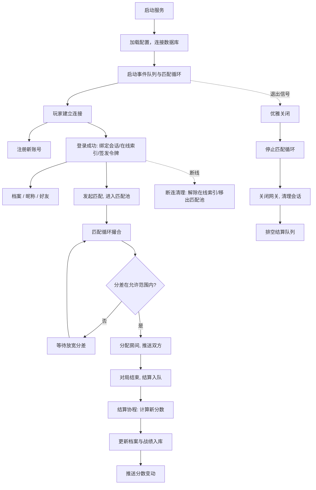

> 这是 SignalDrift 系列开发日志的第三篇。上一篇把网关从零写到了能跑：协议、心跳、限流、优雅关闭。这一篇按约定写网关之上的第一层业务——大厅：账号注册登录、重连 Token、ELO、匹配池、好友、在线索引，以及一条从对局到数据库的异步结算链路。

服务端三层里，网关是地基，大厅是它上面的一层——**账号、登录、匹配、好友、在线状态**，玩家从连上网关到进房间之前，所有"人"的语义都发生在这里。网关的哲学是"不关心业务"（它只认连接、协议、会话、生存），大厅正好相反：它要关心每个业务动作的后果——登录不能泄露用户存在性，结算不能丢分，匹配不能等太久。

## 存储抽象：接口、双实现与语义一致

大厅要持久化账号，第一步是定义存储层。我给自己定的规矩是：**业务代码只认识接口，不认识具体实现**。

```go
type Store interface {
	CreateUser(username, passwordHash string) (int64, error) // 重名返回 ErrDuplicate
	GetUserByName(username string) (*User, error)
	GetUser(uid int64) (*User, error)
	SetNickname(uid int64, nickname string) error
	GetProfile(uid int64) (*Profile, error)
	UpdateElo(uid int64, newElo int, result int) error // result: 1胜/0平/-1负
	AddFriend(uid, friendUID int64) error
	DelFriend(uid, friendUID int64) error
	ListFriends(uid int64) ([]int64, error)
	InsertMatchRecord(r *MatchRecord) error
}
```

于是有了**两个实现**：`MemStore`（内存版，单测用）和 `MySQLStore`（真库）。接口化的好处在测试：业务逻辑的 40 多个测试全部跑在 MemStore 上，毫秒级、无环境依赖；真库用独立的一套集成测试（`//go:build integration` tag 隔离），连上真实 MySQL 才跑。

但接口化有一个隐藏代价，这次真切体会到了：**两个实现的行为必须逐字节一致，否则 fake 会骗过测试**。语义分叉发生过两次：

1. **不存在的 uid**。MemStore 的 `SetNickname` 查不到人时返回 `ErrNotFound`；而 MySQL 版一条 `UPDATE ... WHERE uid=?` 影响 0 行时静默返回 `nil`——"假装成功了"。单测（MemStore）断言"不存在要报错"通过，上线（MySQL）却拿到 `nil`，行为完全不一样。修复：检查 `RowsAffected()`，0 行映射为 `ErrNotFound`。
2. **同值更新**。MySQL 默认没有 `CLIENT_FOUND_ROWS`，`UPDATE` 改的还是原名时同样影响 0 行——被上面的修复误判成"用户不存在"（500）。而 MemStore 对同值更新返回 `nil`，又分叉了。修复：0 行时再 `SELECT 1` 确认用户到底存不存在，存在就是同值更新（nil），不存在才是 `ErrNotFound`。

这两个 bug 都是全分支终审抓到的（后面单独讲终审）。它们的共同教训是：**接口抽象的价值不在定义，在实现对齐**——fake 太"聪明"或太"老实"，都会让单测给出错误的信心。

## bcrypt 与登录：三个安全细节

密码存储直接选 `bcrypt`（`golang.org/x/crypto`），理由：内置盐、可调成本、慢哈希天然抗暴力破解。三个实现细节值得说：

- **成本参数用默认值**。`bcrypt.DefaultCost`（10），哈希一次约 50-100ms。demo 规模无所谓，真到高并发登录要降成本或用别的方案——这是将来要重新评估的点，不是现在。
- **登录失败统一 403，不区分"用户不存在"和"密码错误"**。如果分别回"用户不存在"和"密码错误"，等于帮攻击者枚举用户名。合并成一个错误码，两种失败走同一条代码路径，攻击者得不到任何信息。
- **重复登录踢旧会话**。同一账号在新连接登录时，旧连接被服务端主动关闭（`old.Close()`）。这里有一个精妙的竞态防护：断连回调里解绑在线索引前要检查"索引里绑定的还是我这个会话吗"（`cur == s`）——旧会话被踢后它的断连回调可能延迟到达，如果无脑解绑，会把新会话也解绑掉。**旧回调永远不能误伤新会话**，这条规则后来在匹配池上也复用了。

## 重连 Token：先验证身份，再信任内容

登录成功后签发一个 HMAC-SHA256 签名的重连 Token，格式 `uid.expiry.hexhmac`——客户端断线重连时凭它免密登录。这里最值得讲的是 `Verify` 的**校验顺序**：

```go
parts := strings.SplitN(token, ".", 3)
if len(parts) != 3 { return 0, false }
if !hmac.Equal([]byte(t.sign(payload)), []byte(parts[2])) {
	return 0, false      // ① 先验签名
}
exp, err := strconv.ParseInt(parts[1], 10, 64)
if err != nil || t.now() > exp { return 0, false }  // ② 再查过期
uid, err := strconv.ParseInt(parts[0], 10, 64)
...
```

三个刻意的点：

1. **签名比较用 `hmac.Equal`（恒定时间比较）**。普通比较按字节比，前缀相同越多耗时越长——攻击者可以伪造 token 发给服务器，通过测量响应时间差逐字符猜出合法签名（真实存在的时序侧信道攻击）。恒定时间比较让耗时与内容无关。
2. **签名不过的内容一律不解析**。token 的 `uid.expiry` 是明文，谁都能编一段垃圾塞给服务器。先验签名——secret 只有服务器知道——99.999% 的垃圾输入在解析前就被挡掉了，解析逻辑只对"自己人"执行。
3. **顺序本质是"先验证身份，再信任内容"**：先查格式（3 段）→ 再验签名（防伪水印）→ 才看过期（时间）→ 最后取 uid（身份）。畸形输入（分段错、非数字、空段）全路径安全返回不 panic——这部分我写了一个 8 种畸形用例的表驱动测试钉死。

另一个细节：过期判断用严格大于（`t.now() > exp`），"恰好等于过期时间"仍有效。这个边界语义有一行专门测试保护，防止将来有人手滑改成 `>=` 悄悄改变过期窗口。

## ELO：为什么必须是零和

匹配需要分数，选 ELO。公式是标准的：

```
expected(a, b) = 1 / (1 + 10^((b-a)/400))
delta = round(K * (1 - expected(winner, loser)))
```

两个性质值得讲：

- **零和**：赢家 +delta，输家 -delta，总分不变。这意味着系统的"分数总量"守恒，不会因为对局多了而通胀——这是 ELO 作为排位分而不是经验值的根本原因。
- **爆冷多拿分**：1000 打 1200 赢了，拿的分比势均力敌的对局更多（预期胜率低，赢了的"信息量"大）。测试里专门断言"爆冷得分 > 同分对局得分"，并断言零和（`w-1000 == 1200-l`）——数学性质写进测试，防止将来改公式改出分数通胀。

平局的处理：双方都按"期望差的一半"调整（`round(K * (0.5 - expected))`），低分方微涨、高分方微跌，仍然是零和。

## 匹配池：30 秒放宽的阶梯

匹配的核心矛盾：**分差越小对局越公平，但池子越小匹配越慢**。解决办法是等待时间换分差——等得越久，允许的分差越大：

```
允许分差 = base_gap(100) + gap_step(100) × (等待秒数 / 30)
```

每等满 30 秒，允许分差放宽 100。配对算法是**按 ELO 排序后相邻贪心**：分数排成一行，从低到高看相邻两人，分差在双方允许值（取较大者——等得久的一方拉动匹配窗口）内就配对。排序贪心在这个"分差单调"的性质下，在配对数量最大化这个目标上不劣于任何最优解。

实现上的一个细节：所有时间逻辑走注入的 `now func()`，测试用假时钟拨时间（等 65 秒就 `now = 65`），**全程没有 `time.Sleep`**——和网关的心跳测试同一个套路。时钟回拨的边界也被测试钉死：`now < joinsAt` 时放宽次数不能为负（分差不得被收紧），clamp 到 0。

## 异步结算队列：为什么必须是单协程

对局结算（ELO 变动 + 战绩入库）不能放在战斗线程里直接写库——战斗逻辑在将来的房间进程，写库是慢 IO，会卡住战斗。所以有一条**异步事件队列**：战斗线程只投递事件，一个后台 worker 负责"读档案 → 算新 ELO → 写库 → 记战绩"。

这个 worker **必须是单协程**，原因值得展开：结算流程是"读双方档案 → 算分 → 写库"，同一用户的多次结算有顺序依赖。多 worker 并发时，两个 worker 同时读到同一用户旧档案、基于旧分计算、后写的覆盖先写的——丢分。单 worker 天然串行化：**事件按入队顺序处理，同一玩家永远先结算完一局再结算下一局**。无锁、无竞争、顺序确定。这也是"战斗侧永不直接碰 MySQL"的落点：唯一写库的线程就是这个单 worker。

worker 的消费循环是 Go 里最舒服的一行：

```go
for ev := range q.ch {
	q.process(ev)
}
```

`range` 一个 channel 自带三件事：**阻塞等待**（channel 空时协程挂起，零 CPU 消耗）、**自动唤醒**（有事件时运行时把数据递过来）、**自动退出**（channel 被 `close` 后循环结束）。所以 `Stop()` 只需要 `close(q.ch)` + `wg.Wait()`——"关门 + 等排空"，优雅关闭时最后一局的结算不会丢。

这里有一个踩过的坑：**向已关闭的 channel 发送会 panic**，而且 `select` 拦不住——`Stop()` 之后再有人 `PushMatchResult`，进程直接崩。修复：`closed` 标志 + 互斥锁，关停后 Push 静默丢弃；二次 Stop 幂等。配套两个测试（Stop 后 Push 不 panic、二次 Stop 不 panic）把这条契约钉死。

## 依赖注入：框架开插口，装配方插逻辑

写大厅的过程中反复出现同一个模式：**模块 A 需要某行为，但它不知道行为的具体实现——留一个插口，由装配方（main）在启动时把实现插进来**。这次一共开了三个插口：

| 插口 | 谁提供 | 谁注入 | 触发时机 |
|---|---|---|---|
| `SetOnEloComputed(fn)` | 事件队列 | main：查在线索引推结算消息 | 对局结算完成 |
| `SetOnSessionClosed(fn)` | 网关 | main：大厅清理（解绑+匹配池移除） | 玩家断线 |
| `SetRoomAllocator(fn)` | 大厅 Service | main：真实房间分配（当前为自增 stub） | 匹配成功 |

价值在于**每个模块都不认识别人**：网关不知道大厅的存在（它只管连接），事件队列不知道 Presence 的存在（它只管算账），大厅不知道房间分配怎么实现（它只管撮合）。所有模块通过 `main` 一个点串起来——加一个新模块、换一个实现，只改装配处，业务代码一行不动。这也是"控制反转"最朴素的形态：**不是模块去要依赖，是装配方把依赖递给模块**。

## 主进程装配与优雅关闭

`main.go` 现在是整个服务的接线图：

```
加载网关配置 → 加载大厅配置 → 连 MySQL → 启动事件队列
→ 组装 Service（存储/匹配池/在线索引/队列/Token 签发器）
→ 挂载路由 → 创建网关 → 注入断连回调 → 启动 → 启动匹配循环（每秒撮合一次）
```

关闭顺序是三段式，顺序有讲究：

```
cancelMatch() → srv.Stop() → eq.Stop()
```

先停匹配循环（不再产生新配对）→ 再关网关（断连回调把在线状态和匹配池清干净）→ 最后排空事件队列（把还没结算的对局处理完）。`srv.Stop()` 内部用 `WaitGroup` 等所有读写协程退完，保证断连回调在 `eq.Stop()` 之前全部执行完——**先停生产，再清状态，最后排残留**。

冒烟验证是这一层的毕业考：启动真实进程后，用一个独立的小脚本开两条 TCP 连接，各自"注册 → 登录 → 发匹配"，然后等双方收到 `MatchFound`——两条连接必须拿到**相同的 RoomID**。脚本刻意**不用项目自己的编解码代码**，而是按协议规格手拼字节：测试要用"另一条路"验证，不能自证——如果复用项目代码，编解码有 bug 也会自洽通过。跑通那一刻的输出：

```
OK login smoke61492600 uid=24 elo=1000
OK login smoke61492600b uid=25 elo=1000
PASS match found: room=1, 24 vs 25, oppElo=1000/1000
```

从数据库到网线的整条链路，第一次在真实进程里走通。

## 串起来：大厅全流程

上面按模块讲了一遍，最后用一张图把整个大厅串起来——从玩家建立连接、注册登录、大厅操作、匹配撮合、对局结算，到断线清理和优雅关闭：



这张图也是我对"大厅"这个概念的完整理解：**登录把玩家挂上（绑定会话 + 签发令牌），匹配把玩家送走（撮合 + 房间分配），结算把结果记下（队列 + 写库），断线和退出负责收尾（清理 + 排空）**——四条线汇合在大厅服务的生命周期里。

## 测试体系：三层各管一段

这一层的测试分三层，各有各的职责：

| 层 | 跑什么 | 覆盖 | 环境 |
|---|---|---|---|
| 单元测试 | `go test ./... -race` | 业务逻辑（40+ 用例，MemStore） | 无依赖 |
| 集成测试 | `go test -tags=integration ./internal/store/` | 真实 MySQL 的 SQL 语义 | 本地 MySQL |
| 冒烟测试 | 独立脚本连真实进程 | 全链路（注册→登录→匹配→推送） | 完整服务 |

三个细节：

- **集成测试用随机用户名**防跨次运行冲突，并且每个测试 `t.Cleanup` 删除自己创建的数据——不然开发库会越跑越脏。清理顺序按依赖：好友关系 → 档案 → 用户；
- **集成测试的 DSN 从环境变量读**（`SD_TEST_DSN`），缺失时 `t.Skip`——测试不依赖配置文件，别人 clone 下来跑单测不会因为缺配置而失败；
- **冒烟脚本的编码独立于项目**（见上节）——三层测试各用各的"证据链"，互不背书。

## 终审：单任务审查看树，终审看森林

计划收尾时做了一次全分支终审：把整个计划的全部提交当整体过一遍，找跨模块问题。这次终审抓到了两个单任务审查绝对发现不了的真问题：

1. **登录应答的 `exp` 字段从未赋值**。DTO 里声明了"Token 过期时间"，但登录 handler 构造应答时忘了填——客户端永远收到 `exp: 0`。单任务审查只看"handler 逻辑对不对"，发现不了"DTO 有个字段没人写"。而且字段名 `ExpMsec`（毫秒）和实际语义（Unix 秒）还不符，顺手改了名。修复方案也讲设计：给 Token 签发器加一个 `Expiry()` 方法，和 `Issue` 用**同一个注入时钟**——不然测试里拨了假时钟，过期时间还是真实时间，又对不上。
2. **MySQL 同值更新误报"用户不存在"**（前面存储节讲过）。这是"两个实现语义一致"的漏网之鱼，只在真实 SQL 语义下才存在——MemStore 测试永远测不出来。

终审的价值就在这：**单任务审查看树，终审看森林**——任务审查验证"这一步对不对"，终审验证"连起来对不对"。两次语义分叉 bug 都是接口层的"连起来"问题。

## 这轮的决策与代价

几个值得记录的决策：

- **Go 版本被依赖抬升**。计划 1 定的是零依赖 + go 1.22。引入 `go-sql-driver/mysql` 后，依赖要求 go ≥ 1.24；引入 bcrypt 后要求 ≥ 1.25。实测 `go mod tidy` 压不回去——**零依赖时代定的版本约束，随依赖引入失效是必然的**，提前接受，别硬扛；
- **用户名规则是业务决策不是技术决策**。计划里写"3-32 字符"，中文字符 3 字节/个，32 字节只装得下 10 个中文——注册校验要不要按字符（rune）计？最终定的是：**下限按字符（中英文一致，≥3），上限按字节（中文约 10 字，英文 32 字符）**，一个测试锁定三个边界（2 字拒绝 / 3 字通过 / 11 字拒绝）；
- **该留的缺口明说**。ELO 结算的四条 SQL 没有事务包裹——中途失败会出现"胜者加分、败者没减分"的非零和状态。demo 规模可接受（失败概率极低），记进账本，计划 4 接真实结算时用事务收口。**知道缺口、说清为什么现在不补，比假装没有强**——和网关限流桶的缺口同一个处理原则。

## 小结

大厅这一层从零到能跑，覆盖了：存储抽象（接口 + 双实现 + 语义一致）、账号安全（bcrypt、统一 403、踢旧会话）、重连凭证（HMAC Token 的校验顺序）、排位分（零和 ELO）、匹配（等待放宽阶梯）、在线索引、异步结算（单 worker 串行化）、装配模式（三个依赖注入插口）、测试体系（单元/集成/冒烟三层）、质量闭环（全分支终审）。

对我个人来说，这层最大的收获是把两件事想透了：**接口的价值不在定义，在实现对齐**——fake 与真实现语义分叉，单测就会给出错误的信心；**单 worker 的串行化是一种被低估的并发方案**——很多"需要锁"的场景，本质是"顺序有依赖"，用一个消费者把顺序天然保证掉，比加锁简单一个量级。

下一篇写计划 3：Unity 客户端——把这条从网线到数据库的链路，接到一个能玩的游戏画面上。
