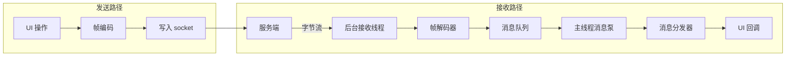
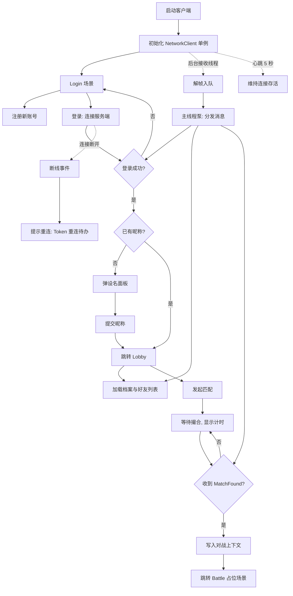

> 这是 SignalDrift 系列开发日志的第四篇。前三篇把服务端的两层（网关、大厅）从零写到能跑。这一篇是计划 3：Unity 客户端——把那条从网线到数据库的链路，接到一个能玩的游戏画面上。

服务端的两层已经在 Go 里跑起来了，客户端是这条链路的另一端——**同一个协议，要翻译成第二套实现；同一套约束，要翻译成另一种语言**。字节序、程序集引用、主线程纪律，全是服务端没踩过的坑。这一篇按"从字节到画面"的顺序，把协议翻译成 C#，把约束写进编译器，最后让 UI 接上业务。

## 分层：先定规矩，再写代码

客户端和服务端是同一个问题域的两个方向：服务端是"连接管理 + 业务"，客户端是"连接管理 + 画面"。我给自己定的分层是三层，各管一段：

```
Net/Protocol  纯 C# 协议层（编解码/消息号/DTO）——不碰 UnityEngine
Net/NetworkClient  连接层（MonoBehaviour 单例，收发线程 + 主线程泵）
UI/ 场景脚本（LoginController / LobbyController）
```

最关键的规矩是：**协议层不许碰 UnityEngine**。理由很实际——协议层是"和服务端字节级对话"的部分，它应该可以被单元测试、被将来的控制台压测工具直接复用；一旦它依赖 MonoBehaviour，测试就离不开 Unity 环境，复用就绑死编辑器。这个约束后来用程序集机制从"注释里的愿望"变成了"编译器的强制"（下面讲）。

## 字节级一致：同一份协议，两个实现

协议在 Go 端已经定义了：12 字节头（`magic|msgID|seq|bodyLen`）+ body，大端序。C# 端要做的是**逐字节复刻**，不能差一个位：

```csharp
// C# 端 Encode：手写大端移位
b[0] = (byte)(Magic >> 8); b[1] = (byte)(Magic & 0xFF);
b[2] = (byte)(msgId >> 8); b[3] = (byte)msgId;
b[4] = (byte)(seq >> 24); ...
```

两个细节值得说：

1. **`(byte)Magic` 会编译报错**。C# 对常量转换做溢出检查（`0x5344 = 21316 > 255`），而 Go 用 `binary.PutUint16` 运行时写字节没这个问题——同一段逻辑，两种语言踩不同的坑。修法是 `(byte)(Magic & 0xFF)`；
2. **测试用非对称值**。seq=42、msgId=7 这类"大小端写反会变样"的值，专门防止实现把大端写成了小端——如果手滑，42 会变成 0x2A000000，测试立刻抓出来。

解码端（`FrameDecoder`）复刻 Go 的 `FrameReader`：字节流喂进来，凑满 12 字节头才解析，body 没齐就等下次（半包）；魔数错、超 64KB 直接抛异常。测试里有一个"一个字节一个字节喂"的极端拆包用例——和 Go 端 `iotest.OneByteReader` 的用例是同一个思路的两份实现。

**编解码两侧对称防护**：Encode 和 Decoder 都检查 body 超限（64KB）。客户端自己编一个超限帧发出去，服务端解码会抛协议错误断开连接——"自己把自己踢下线"，所以发出前就要挡一道。服务端是 `Session.Send` 入口挡的，客户端是 `Encode` 挡的，位置不同，闭环相同：**发之前挡一道，收的时候再挡一道**。

## 程序集铁律：把约束写进编译器

"协议层不许碰 UnityEngine"——光写在注释里没人保证。正确做法是用 **asmdef + `noEngineReferences`**：

```
SignalDrift.Protocol   asmdef，noEngineReferences: true
  ↑ 被引用
SignalDrift.Net        普通程序集（NetworkClient 是 MonoBehaviour）
  ↑ 被引用
SignalDrift.Tests      EditMode 测试程序集
```

`noEngineReferences: true` 意味着：**谁在协议代码里写 `using UnityEngine`，编译直接报错**。约束从"团队纪律"变成了"机器强制"——这是我能想到的让铁律真正成立的方式。

踩过的一个坑：asmdef 的 `references` **不能引用预定义程序集 `Assembly-CSharp`**（Unity 硬限制，asmdef 只能引用 asmdef）——所以主代码必须有自己的 asmdef 才能被测试程序集引用。这也顺带形成了上面的三层结构。

## 线程模型：后台只入队，主线程只消费

Unity 的铁律：**MonoBehaviour 和 UI 只能被主线程碰**。网络收发天然是后台活，两者怎么协调？

```
后台接收线程：socket.Read → FrameDecoder → 帧入 ConcurrentQueue（仅此而已）
主线程 Update：从队列泵出帧 → 分发器 → UI handler
```

后台线程的职责被压到最小：读字节、解帧、入队——**它连 handler 是什么都不知道**。所有业务回调都在主线程执行，UI 随便碰，不用加锁。发送方向反过来：UI 调 `Send()` → 编码 → 写 socket（发送用锁保护，因为可能多个调用方）。

这套模型的好处是**心智负担小**：线程边界只有一条（队列），规矩只有一条（后台不碰 UI）。代价是消息有队列延迟（一帧内），对大厅这种低频业务毫无感知。

客户端的两条消息路径，一张图收拢：



**接收路径**：后台线程只做"读字节 → 解帧 → 入队"三件事，业务 handler 全在主线程；**发送路径**：UI 直接编码写 socket，发送加锁。两条路径在 socket 处汇合，线程边界只有队列一条线。

## 分发器与 DTO：服务端的镜像

客户端的 `MessageDispatcher` 和服务端的 `Router` 是同一个设计的两面：**消息号 → 处理函数**的注册分发。区别只有一处——服务端的 handler 带 `Session` 参数（多客户端要寻址），客户端的 handler 只有 `body`（单连接不需要寻址）。一条连接不需要路由地址，这是"服务端路由、客户端分发"的本质差异。

DTO 的对齐是最机械也最容易错的一步：服务端 JSON tag 是 `room_id`、`opp_uid` 这种下划线命名，而 C# 惯例是驼峰。`JsonUtility` 不支持属性重命名，**所以 C# 字段直接用小写下划线命名**，与服务端 JSON 逐字对齐：

```csharp
[Serializable] public class MatchFoundPush { public long room_id; public long opp_uid; ... }
```

测试里直接放**服务端真实输出的 JSON 样例**反序列化断言——用真实数据锁对齐，而不是自产自销。

## 配置外部化：客户端也配 JSON

服务端有个硬约束"代码里不写死任何数字"，客户端一开始把 `host/port` 写死在了默认值里——风格不一致。补上：`Resources/network_config.json` 放连接参数，启动时加载，缺失时 fallback 默认值。客户端和服务器一样，**连接参数来自外部配置**。

## 场景流转：从登录到战斗占位

三个场景，`Build Profiles` 顺序 0/1/2：

```
Login（注册/登录/设名）→ Lobby（档案/匹配/好友）→ Battle（占位）
```

跳转用索引加载（`LoadScene(1)`），依赖 Build Profiles 的场景顺序。这里有个 Unity 6 的新坑：**场景没加进 build profile 时，`LoadScene("名字")` 直接报错**——编辑器 Play 模式也不例外。所以场景必须先进 build 列表，这本身也是好约束（打包时不会漏场景）。

## TMP 中文字体：一次止损的技术复盘

这一节是本期最值得写透的教训。游戏是中文的，UI 必须显示中文，但 **TextMeshPro 默认字体（Liberation Sans）不含中文字符**。为了让它显示中文，我先后试了五条路，全部失败或不可靠：

| 方案 | 失败原因 |
|---|---|
| 动态字体（运行时按需生成字形） | 图集满了之后新字符生成失败 → **随机缺字**（"注册成功"变成"注册 u 7 登录"） |
| DynamicOS（系统字体渲染） | 该环境渲染不稳定 → **全没字** |
| 动态 4096 大图集 | 资产反复删除重建，GUID 变化 → **场景引用全部悬空** |
| 静态烘焙全 CJK 范围 | 两万汉字超过单图集容量 → **后段汉字全缺** |
| 常用字表 + 手动烘焙 | Font Asset Creator 的加载/生成环节不可靠 |

三条根因拆开看：

1. **动态模式的每次字形生成都是一次运行时赌博**——图集满、字体数据缺失、生成竞争，任何一环出问题就是缺字，而且缺得随机，测试都难复现。**中文 UI 的正路是静态烘焙**：字形全在资产里，运行时零生成；
2. **资产重建 = 引用灾难**——删除重建字体资产会让 GUID 变化，场景里所有引用悬空，文字全部消失。**字体资产一旦定型，永远不要删了重建**；要升级就新建资产，再用脚本统一替换引用；
3. **字符集容量是硬约束**——4096 图集大约装 2000 个 90px 的字符，全 CJK 两万字要 10 个图集。静态烘焙必须选**常用字子集**（GB2312 一级 3755 字覆盖 99.9% 日常文本）。

止损决策：demo 阶段**英文 UI + Unity 自带字体**（静态、稳定、零依赖），中文方案记录为待办（Asset Store 现成简体 TMP 字体包，或思源黑体 SC 静态烘焙——OFL 开源可商用）。**止损不是失败，是成本核算**：在练手项目上为一个字体问题投入无限轮次，不如先把链路跑通。

## 串起来：客户端全流程

上面按模块讲了一遍，最后用一张图把整个客户端串起来——从启动、登录、大厅、匹配到战斗占位，以及背后的线程泵和断线路径：



这张图也是我对"客户端"这个概念的完整理解：**主线程是前台（UI 和业务），后台线程是后勤（收发和入队），队列是唯一通道**——登录、档案、匹配推送全走同一条泵；断线和心跳是两条虚线，决定连接的生命周期。

## 全链路验收：双开匹配

打包成 Windows exe，开两个实例——这是计划 3 的毕业考：

```
客户端 A（exe 实例 1）：注册 → 登录 → 设名 → 进大厅
客户端 B（exe 实例 2）：同上
双方点 Start Match → 1 秒内同时跳转 Battle 占位场景
验收：两个窗口 Room 号相同（Room 1）、对手 UID 交叉正确、服务端无 ERROR
```

跑通的那一刻，Unity 窗口 → Go 网关 → MySQL 的整条链路闭环。顺带验证了心跳（exe 停止后服务端 15 秒巡逻踢掉）、好友（按 UID 单向添加、在线状态 ●/○）这些前几期实现的功能，在真实客户端下都正常工作。

## 已知缺口：诚实清单

练手项目，跑通为主，缺口明说：

- **好友操作无结果反馈**（失败静默；方案已记录，用独立状态文本）
- **好友删除/登出**：协议就绪，UI 无入口
- **断线重连**：Token 签发/验证已就绪，重连消息和客户端逻辑未做（计划 4 随房间恢复一起做）
- **好友在线状态实时刷新**：目前进大厅拉一次
- **中文字体**：英文止损中（恢复方案见上节）
- **战斗场景**：占位，真实玩法在计划 4

## 小结

客户端这一层从零到能跑，覆盖了：分层架构（纯 C# 协议层）、字节级对齐（同一协议两个实现）、程序集铁律（约束编译器化）、线程模型（后台入队主线程消费）、服务端镜像（分发器与 DTO）、配置外部化、场景流转与打包、中文字体止损复盘、双开全链路验收。

对我个人来说，最大的收获是两件事：**"约束写进编译器"比"约束写进注释"可靠一个量级**——`noEngineReferences` 一行配置顶十行团队纪律；**止损本身是工程决策**——在练手项目上为一个字体问题投入无限轮次，不如先把链路跑通，把教训记下来，等做正事时一次做对。

下一篇写计划 4：房间对战——把占位的 Battle 场景换成真实的涂色对局，让"信号漂流"真正能玩起来。
