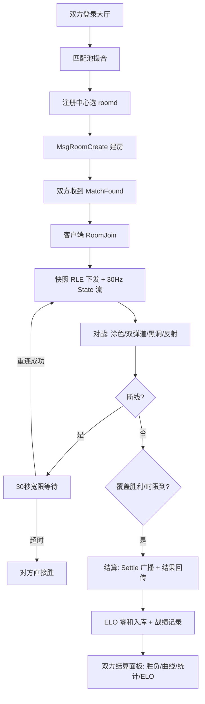

> 这是 SignalDrift 系列开发日志的第五篇，也是计划 4 的收官篇。前四期把网关、大厅、客户端串成了一条能匹配的链路；这一期把占位的 Battle 场景换成真实的涂色对局——让"信号漂流"真正能玩起来。

前四期搭起来的是一条"能匹配"的链路：从 TCP 字节流到匹配撮合，两个玩家能进同一个房间——但房间里的 Battle 场景只是一块占位文本。这一期补上最后一块拼图：一个真实的涂色对战。路线分四步——先写一个确定性的战斗模拟库（所有玩法规则的唯一事实源），再把它装进独立进程（容量、隔离与热更），用增量+快照双轨同步到客户端（实时且自愈），最后用满载压测和异地双人联机验收（数据与手感）。

## 为什么房间要独立进程

服务端的前两层（网关、大厅）在同一个进程里，房间对战我特意拆成了独立进程 `roomd`。三个理由：

1. **容量独立**：网关管连接、roomd 管对局——加机器 = 加容量，负载均衡器按房间数分配；
2. **崩溃隔离**：战斗模拟是 CPU 密集的 30Hz 循环，一个房间写崩不该拖垮登录；
3. **热更**：`battle.json` 的 mtime 变了，新对局自动用新配置——调平衡不重启进程。

代价是跨进程通信：网关和 roomd 之间走内部 TCP，复用既有的帧协议，新增一批内部消息号（注册/负载/建房/转发/推送/结算）。

## 模拟库：纯净得可以逐字节复现

战斗核心是 `internal/battle`——一个零网络、零 IO 的纯逻辑包。确定性是第一原则：**随机数注入、时钟不读系统时间**——同一个 seed、同一串输入，世界走向完全一致。这让测试有了底气：涂色覆盖率、弹道落点、黑洞弯轨，全可以用精确数值断言。

世界的核心是 128×72 的格子矩阵：

- **掩码**决定格子性质：墙、黑洞禁涂圈、主塔永久色、自由格——四类，优先级固定；
- **涂色**只允许自由格，变更才记入脏集合——这是增量同步的数据基础；
- **覆盖率** = 己方涂色格 / 可涂格，永久塔区计入分母也计入初始分子——开局双方对称。

两种弹道构成玩法主轴：**直射**（便宜快速，沿途拖出墨线）和**抛射**（昂贵，越墙炸开一大片），加上黑洞弯轨、反射墙镜像、命中减速——物理规则全部在服务端，客户端只负责显示。

## 30Hz 同步：增量省带宽，快照保正确

对局以 30Hz 推进，每 tick 广播状态包：

- **状态包**：玩家位置/能量/弹体/覆盖率/倒计时/剩余时间 + **脏格子列表**（只带本帧变化的格子，14 位索引 + 2 位颜色打包成一个 uint16）；
- **快照包**：RLE 压缩的全量格子，开局发一次，之后**每 1 秒定期补发**。

增量同步省带宽，但有一个致命弱点：**丢一个状态包，那帧的涂色就永久缺失**。快照定期校准就是补这个洞——客户端检测到快照 tick 变化就全量重涂。**增量保证实时，快照保证正确，两者相加才是完整的同步方案**。

客户端收到状态包后做**两帧插值**：渲染时间 = 最新服务器 tick 时间 −100ms，在缓冲的两帧之间 Lerp——移动平滑，无跳变。

跨语言协议的正确性怎么保证？**对拍**：Go 端把真实输出（比如一个输入包的 7 个字节、一次 RLE 快照的完整 hex）固化进 C# 测试的字面量——C# 端解码结果必须和 Go 的真实输出逐字节一致。测试里那条 159 字节的 RLE hex，是 Go 端真实跑出来的快照，不是手写的"预期"——**用另一条路验证，不能自证**。协议双端各写一次实现，各用自己的测试，对拍字面量把两边钉在同一份真实数据上。

## 注册中心与负载均衡：满载边界抓出的死循环

网关侧维护一个 roomd 注册中心：实例注册时上报容量，每 5 秒上报负载；匹配成功时选负载最低的实例建房。看似简单，**压测在满载边界抓出了一个真死循环**：

```
roomd 满载 → 注册中心（负载视图 5 秒滞后）还在分配 → 建房被拒
→ 玩家回池 → 下一轮又选到同一个满载实例 → 无限循环
```

修复是 `MarkFull`：建房被拒时，网关**本地立即标记该实例满载**，分配器立刻跳过，等下一次真实上报刷新。一行状态，消除了一个"满载时匹配系统瘫痪"的确定性故障。这是压测的价值——**正常负载下永远不会暴露，满载时才现形**。

## 代码审查：先把问题抓在合入前

压测之前，每一任务的代码审查已经抓过一轮更隐蔽的问题。最有代表性的是两个任务被判定 **With fixes**——必须修复才能合入：

- **结算重复计分**：结算触发没有锁存标志，展示期内每 tick 都重复广播、重复回调——真接上 ELO 的话，一局结算会被计分约 300 次。修复是一个 `settled` 标志；
- **网关 Stop 死锁**：优雅关闭只关监听器不关已建立的 roomd 连接，`wg.Wait()` 永久挂起——只要停机瞬间 roomd 在线，网关就退不掉；
- **roomd 崩溃后匹配系统瘫痪**：死连接不清出注册中心，分配器持续选中它，所有新匹配永久失败——修复是断连时自动注销 + 解绑全部 UID；
- **永不入房的幽灵房间**：匹配成功后玩家掉线不 Join，房间占着容量槽永远不释放，排空缩容也退不出——修复是等待超时判负；
- **假房号**：注册中心的负载视图滞后，满载瞬间建房可能被拒——但 MatchFound 已经发给玩家了，玩家拿着不存在的房间号去 Join 直接 404 卡死。修复是建房被拒时回传 `MsgRoomReject`，网关解绑、玩家回池、**本地标记该实例满载**（和 MarkFull 是同一套闭环）。

回头看，这些问题的共同点：**单线程测试全绿掩盖了它们**——要么是并发缺陷（锁/重复触发），要么是需要"某种特定时刻"才触发的生命周期问题。审查的价值在于要求用生产接线后的真实场景推演，而不是只看测试过不过。

## 断线重连：30 秒宽限

玩家掉线后，房间给他 30 秒宽限：置离线、停止推送，但**房间绑定不解绑**——客户端自动重连（每 2 秒重试，最多 15 次）→ 重新登录 → 重新入房 → 收到新快照继续打。宽限内没回来，对手直接获胜。

这里有个值得记的教训：重连流程的"变量遮蔽"bug 直到第一次手动 Ctrl+C 才暴露——**优雅关闭路径从没被真实触发过**。新代码路径第一次被真实调用时，最可能暴露初始化类 bug。

## 结算闭环

对局结束（覆盖倒计时胜利 / 时限判定 / 断线判负）→ 房间广播结算 JSON（胜负、最终占比、**占比历史曲线**、双方统计）→ 同时把结果回传网关 → 入大厅的异步结算队列 → ELO 零和更新、战绩入库 → 在线玩家收到 ELO 推送。**一局对局从开始到入库，走完一整条跨进程链路**。

## 客户端：第一次"看得见"

涂色层是 128×72 的纹理贴满世界，快照全量刷、脏格子增量点、帧末 Apply；玩家是代码生成的三角精灵，弹体是带拖尾的圆点，抛射自带落点预警圈。HUD 显示昵称、双色占比条、能量、倒计时；结算时先播"胜方颜色从主塔涌满全屏"的演出，再淡入结算面板。

这层的"Unity 特有的坑"最多，几个有代表性的：

- **Awake 竞态**：面板初始隐藏由场景未勾选保证，但 `Awake` 里又写了 `SetActive(false)`——`Show()` 激活面板的瞬间，Awake 才执行，**把刚激活的面板又关了**。数据填了、按钮能点，就是看不见；
- **LineRenderer 坐标空间**：`SetPosition` 默认是世界坐标，我在墙的局部坐标下画描边——全部画到原点附近，加上墙的 scale 放大，白框巨大；
- **Unity 6 内置资源失效**：`Resources.GetBuiltinResource("UI/Skin/Knob.psd")` 直接抛异常——玩家和弹体生成全断，最后全部改成代码生成纹理；
- **Sprite 的 PPU 尺寸链**：pixelsPerUnit 决定"像素 → 世界单位"的换算，我在墙、玩家、弹体、涂色层上各算错一次——小 10 倍看不见、大 10 倍盖满屏，最后统一成"PPU=1 + scale 直控"才消停；
- **输入系统换代**：`Input.GetKey` 在新 Input System 下直接抛异常，报错信息还特别像配置问题——换成 `Keyboard.current` 才是 Unity 6 的正道；
- **数据竞态**：昵称在 `Start` 里设置，但那时快照还没到、`MySlot` 还是默认值——两个客户端一个对了一个错了，改成"等数据就绪再渲染"。
- **一个自锁的输入循环**：发送输入前检查"已发送过"，而置位语句在检查之后——第一次调用就被挡死，输入永远发不出去。

## 压测：满载之下见真章

- **192 房间满载**（3 个 roomd × 64 房）：11520 包/秒推送，30 秒**零丢失零乱序**，负载均衡 64/64/64 均分；
- **纯吞吐**：网关请求-响应峰值 188k 帧/秒，节流下 65-70k 帧/秒稳定处理、送达率 99%+；
- **满载收敛**：2 次建房拒绝后 MarkFull 立即收敛，玩家重配全部入房。

压测还暴露了一个测试脚本自己的缺陷：客户端不发心跳，15 秒全体被踢——这恰好验证了**心跳踢人 + 断线通知在满载下精确工作**。

压测方法本身也有三个坑，写出来免得后来者踩：**同机压测的忙循环会抢 CPU**——客户端发送 goroutine 是无限循环，500 连接时客户端自己把 CPU 抢走一半，测出的吞吐反而暴跌，数据点之间波动巨大（节流后的数据才可信）；**无节流时 1000+ 连接要先全部建连再统一发包**——否则发送流量饿死 accept，后续 dial 直接阻塞；**压测客户端也要发心跳**——否则 15 秒后全体被踢，测的是"断线"而不是"满载"。

## 双人联机：从练手到能玩

最后一刻的验收不是自动化测试，而是**和一个朋友异地打了一整局**：Tailscale 组虚拟局域网，他改一行 `network_config.json` 的 host，登录、匹配、对战、结算、ELO 变化——完整走完。那一刻，这个从空仓库开始的项目，变成了一个真能和朋友玩的游戏。

## 串起来：对局全流程

上面按模块讲了一遍，最后用一张图把整局对战串起来——从匹配入房、30Hz 同步、断线重连到结算入库：



## 小结

计划 4 把一条"能匹配"的链路变成了"能对战"的游戏：纯逻辑模拟库打底（确定性可测）、独立进程承载容量（热更/隔离）、增量+快照双轨同步（实时+自愈）、满载边界靠压测现形（MarkFull）、断线重连补全生命周期、客户端渲染让一切看得见，最后用异地双人联机画上句号。

最大收获依然是那几条被反复验证的原则：**纯逻辑与 IO 分离让测试有底气**、**确定性让 bug 可复现**、**压测要在满载边界跑**、**新代码路径第一次被真实调用时最危险**。而"朋友真的和你打了一局"这件事本身，就是对这四期所有决策的最终验收。
