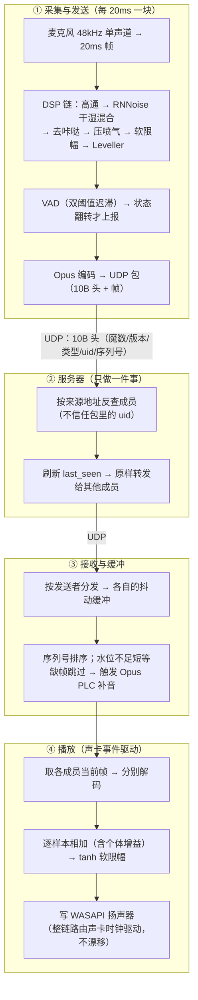

## 项目背景

做 EchoRoom 的动机有两个。一是**给朋友圈做一个能用的语音房**——平时朋友们用 Oopz 开个固定房间连麦，我想做一个自己的：轻量、打开即连、桌面端。二是继续补 LetterSink 留下的课——上一次做的是"系统声音 → 文字"（离线识别管道），这一次想做**"麦克风 → 网络 → 扬声器"的实时链路**：延迟敏感、丢包容忍、多人同时说话。音频处理这条线，一进一出才算走完。

目标定得很具体：**单房间 6 人、允许 2~3 人同时说话、带公屏文字**；核心链路——网络收发与转发、音频采集与播放、抖动缓冲、混音——全部亲手实现，只有"没有学习意义"的成熟件（Opus 编解码器、RNNoise 降噪模型）用库。后来朋友们真的在游戏开黑时用它连麦，反馈一路把项目推到了 0.3.0：投屏、摄像头、账号、设置都补齐了。

技术选型上：

- **Rust + std 线程/channel，不用 async 框架**：6 人规模的并发量用不到 async 的调度能力；而我这次想学的恰恰是**显式线程模型**——哪个线程负责什么、数据经哪个 channel 流动，都摆在明面上。async 的 Future 状态机很优雅，但它会把"数据此刻在谁手里"藏起来，这一课留到以后上；
- **WASAPI**：LetterSink 已经把采集和回环趟过一遍，麦克风采集是同款 API，这次在上层继续挖；播放端也用同一套事件驱动模型；
- **tauri v2 + 原生 JS/CSS**：跟 LetterSink 同构的"WebView 界面 + Rust 后端"；意外之喜是后期视频落地时，WebView 里的 **WebCodecs** 直接把 H.264 编解码这块"大骨头"接了过去，Rust 侧零新增依赖；
- **不用 WebRTC**：这不是说 WebRTC 不好，恰恰相反——它"太完整"了：AEC/NS/AGC、抖动缓冲、NACK/FEC、拥塞控制全部封装好。用它我能最快做出产品，但本项目想学的每一层都会变成黑盒。目标不同：**产品用 WebRTC，学习项目亲手做**；
- **服务器只做"管道"**：全项目的架构基调，详见下文决策 1。

从 9 月中旬的第一版设计文档，到 0.3.0 打包交付，前后约一周多——中间走完了一轮"自己写 → 朋友用 → 收反馈 → 迭代"的真实循环（十来个反馈轮），这比任何课程都长功力。

## 总体架构

整体是 **Rust workspace 三段式**：`protocol`（共享协议 crate）+ `server`（无界面服务器）+ `client`（tauri 客户端）。一句话概括数据流：**TCP 走控制、UDP 走语音，服务器只转发，所有音频理解都在客户端**。

```
┌─ 成员电脑（客户端：tauri + WebView UI）───────────────┐
│  UI（HTML/CSS/JS）：登录 / 卡片网格 / 公屏 / 设置 / 观看  │
│        ↕ invoke / emit（与 LetterSink 同款桥接）        │
│  Rust：                                               │
│    采集线程  麦克风 → DSP 链 → VAD → Opus → UDP ────────┤
│    播放线程  UDP → 抖动缓冲 → 解码 → 混音 → WASAPI ─────┤
│    TCP 线程  认证 / 成员 / 公屏 / 说话与静音 / 订阅关系   │
│    视频链路  WebView 采集编码 ↔ Rust 分片收发重组        │
└───────────────────────────────────────────────────────┘
                          ↕ UDP（语音/视频）+ TCP（控制）
┌─ 云服务器（无界面 Rust 程序）──────────────────────────┐
│  TCP：每连接一线程——认证、成员管理、公屏、状态广播、订阅    │
│  UDP：单 socket 主循环——语音全员原样转发；               │
│       视频只发给订阅者（不解码、不混音、不加工）           │
└───────────────────────────────────────────────────────┘
```

一帧语音从"嘴"到"耳朵"的完整旅程：



几个设计亮点：**服务器里没有一行音频逻辑**——收包、查地址、转发，CPU 开销趋近零，最不容易出错的地方恰好是最"无聊"的地方；**客户端每个线程一个职责**，线程间只用 channel 传数据，唯一的共享状态是房间信息（`Arc<Mutex>`，低竞争）；**协议 crate 是单一事实来源**——客户端和服务器编译同一份编解码代码，协议不一致在单测和编译期就被拦下，不会出现"两端对不上"的运行时玄学。

## 关键技术决策

**1. 服务器只做管道：转发中继，而不是服务端混音**

语音链路有三种典型架构：服务端混音（MCU，服务器把所有人的声音解码混合成一路下发）、P2P 网状（人人直连）、纯转发（服务器不解码，原样把每人的包转给其他人）。选了第三种：

| | 服务器 CPU | 延迟层数 | 音质 | 客户端要做的活 |
|---|---|---|---|---|
| 服务端混音 | 高（每路解码+混音+编码） | 多一跳 | 二次编码有损 | 只播一路 |
| P2P 网状 | 无（无服务器） | 最少 | 无损 | NAT 穿透、多路混音 |
| **纯转发（选用）** | **≈0（memcpy 级）** | 少 | 无损 | 多路解码+混音 |

代价是带宽随人数平方增长：每人上行 1 路、下行 N-1 路，6 人满房服务器出口约 1.2 Mbps——2 核 2G、十几 Mbps 带宽的轻量云服务器完全撑得住。**用带宽换 CPU、延迟、音质，同时把"混音"这个最有学习价值的部分留在客户端**——这个换算成立的前提是"6 人"，人数上限写死进设计，想扩规模就得换架构，这一点在文档里说得明明白白。

安全性上做了一个小设计：**UDP 语音包不信任包里的 uid**。TCP 登录时服务器发一个随机 token，客户端 UDP 首包带 token 注册，从此服务器按"来源地址"反查成员——冒名者伪造 uid 也发不出声。

**2. 不用 async：std 线程 + channel 的显式并发**

全项目没有一行 async/await，也没有 tokio。客户端四个线程各司其职（采集/接收/播放/控制），服务器"每连接一线程 + UDP 单循环"。这个决定一小半是主动的（学习目标），一大半是**被 Rust 类型系统推着做的**：WASAPI 是 COM 接口，相关对象**非 Send**——编译器直接拒绝把采集句柄移出创建线程。于是"采集 → 编码 → 发送"必须同线程内顺序循环，架构几乎是被约束推导出来的：

```rust
// 采集线程内循环（示意）：COM 对象不跨线程，链路顺序执行
let mut capture = MicCapture::open(device_id)?;      // WASAPI（非 Send）
loop {
    let mut block = capture.read_block()?;            // 20ms
    dsp.process(&mut block);                          // DSP 链
    let opus = encoder.encode(&block);                // 20ms 一帧
    udp.send_voice(opus);                             // 发出
}
```

代价也真实：共享房间态要 `Arc<Mutex>` 包起来、线程退出要手工设计停止语义。但换来的是"每个线程的输入输出、阻塞点、生命周期"都一目了然——排查问题时能画出数据流图，而不是猜哪个 Future 卡住了。

**3. 自研二进制协议：双通道分工 + 单一事实来源**

不用 JSON、不用 serde：语音每 20ms 一个包——包头每多一个字节，都要乘以每秒 50 个包。协议分两条通道：

- **TCP 控制**：`[长度 u32][类型 u8][载荷]` 字节流分帧，手写二进制序列化（字符串 = u16 长度 + UTF-8）——认证、成员、公屏、说话/静音状态、订阅关系；
- **UDP 语音**：10 字节固定头 `[魔数 u16][版本 u8][类型 u8][uid u16][序列号 u32]` + Opus 帧——语音、心跳、视频分片、屏幕音频共用一条端口。

整个协议写在 `protocol` crate 里，客户端和服务器共同依赖。这个"单一事实来源"的组织方式在后来协议破坏性变更（账号系统把"输入昵称即登录"换成认证三件套）时救了大命：只改一个 crate，两端编译即对齐，版本号一升（客户端 0.2.0），旧客户端连新服务器被干净拒绝。

**4. 抖动缓冲：把"网络的不可靠"工程化**

UDP 不保证顺序、不保证送达，但播放端需要"每个成员一条连续的声音"。方案是**每发送者一条独立抖动缓冲**：

```rust
// 播放线程每周期：取各缓冲的"当前帧"（示意）
for sender in room.senders() {
    let frame = jitter[sender].pop_due();   // 水位不足 → 短等
    // 水位 3~4 帧（60~80ms）；缺帧等超时后跳过 → 推空帧进解码器触发 PLC
    let pcm = decoder[sender].decode(frame); // Opus 内置丢包隐藏补音
    mixer.add_scaled(pcm, gain_of(sender)); // 个体增益
}
mixer.limit_and_write(&mut render)?;          // tanh 软限幅后写出
```

三个细节都是被 bug 教出来的：序列号是 u32 **会回绕**，比较必须用环形差值（普通大小比较在回绕点会颠倒）；发送侧"静音不发包"会让接收侧序列断裂，恢复时要做**序列重对齐**（否则缓冲会一直"等一个永远不来的帧"）；水位是延迟与卡顿之间的静态取舍——3~4 帧是实测手感与延迟的平衡点，更激进的低水位在弱网下会频繁触发跳帧。

**5. 视频：全 WebView 采集编码 + 订阅式按需转发**

投屏与摄像头的编码没有一行 Rust：`getDisplayMedia`/`getUserMedia` 采集 → `MediaStreamTrackProcessor` 取帧 → canvas 缩放 → **WebCodecs H.264 硬编**。动手前先做了 spike：六项前置验证（选择器可用性、编码器出帧、IPC 二进制吞吐、进程回路……）全部通过，方案才落地——"把硬骨头交给 Chromium"的前提是先确认它真的嚼得动。

传输沿用既有 UDP 通道，新增两类包（视频分片 ≤1150B、屏幕音频），核心是**订阅制**：谁点了"观看"才给谁转发，没人看就通知发送端停止推流。丢包策略与语音相反——**任何一片丢失就丢整帧**（时效优先，不重传），解码端连续失败就请求关键帧；订阅成功立刻请求一次关键帧实现"秒开"。

投屏声音有个容易忽略的坑：如果要共享系统声音，**必须把 EchoRoom 自己发出的声音排除掉**——否则房间里的语音会被录进去再转给观看者，形成回环回声。用的是 WASAPI 进程回路 + 排除自身进程树（Zoom/Teams 同款 API，Windows 11 才开放），Win10 上该开关置灰并提示。

**6. 采集链的"亲手实现"：DSP 与增益语义**

采集链的每个增益环节都是自己写的：**100Hz 二阶高通**（切气流低频）→ **RNNoise 自适应干湿混合**（说话段保留 25% 原始信号回补高频细节，噪声段全湿强抑制）→ **DeClicker**（咔哒瞬态抑制）→ **PopLimiter**（喷气低频突冲抑制）→ **tanh 软限幅**（60% 拐点、95% 渐近线，替代硬削波）→ **Leveller**（持续过响压缩）→ VAD → Opus。前两个是"治理"、后两个是"保险"，中间两个是**后面两个踩坑的主角**。

增益系统有两个语义设计值得记录。其一，**手动静音 = 采集继续、判定继续、但不发包不广播**——VAD 状态机保持连续，解除静音立即恢复，没有"重启采集"的毛刺；不变量是 `muted == true ⟺ self_gain == 0`，两个字段永远同步写，UI 无需特判。其二，个体音量的持久化**按昵称而不是 uid**——uid 每次连接都会变，昵称才是稳定的"人"。设置系统后来把设备热切换也做成了同一哲学：采集线程内部软切换、播放线程外层"重初始化循环"，换设备不重启管线、不丢抖动缓冲状态。

**7. 功能开关：构建前裁剪，而不是运行时开关**

"某些功能不想要了，关掉之后打包产物里就不要出现"——这个需求有三种做法：Rust 的 feature flags（编译期裁剪，但客户端功能大半在前端，够不着）、运行时设置项（简单，但"关闭"只是藏起来，代码和入口还留在产物里）、或者构建前的一份配置文件。我选了最轻的第三条：一个纯前端文件管住所有开关，改完重新打包生效，零构建工具改动：

```js
// client/ui/features.js —— 构建前配置
// 修改后需重新打包生效：cargo tauri build（dev 模式刷新即生效）
// 关闭的功能：界面不显示、行为不生效
window.FEATURES = {
  sound: true,      // 进出音效（含设置页"音效"分类）
  theme: true,      // 6 套主题（含外观页主题区）
  background: true, // 自定义背景图（含外观页背景图区）
};
```

关键在"双短路"：关闭的功能不只是界面藏起来——**界面层不渲染**（设置页对应分类整个消失），**行为层也不接线**（音效关闭后连默认提示音都不会播，主题关闭后固定默认皮肤、连已保存的配置都不读）。文件缺失或写错时默认全开、不崩溃——裁剪是可选动作，不是必答项；同一套代码，可以按需要打出不同"功能面"的产物。

## 踩坑记录

### 踩坑 1：读"3"就爆音——DeClicker 的三次进化

**现象**：读数字 3 时对方会听到"咔"的一下——一个很短的、带有撕裂感的爆音；打字时机械键盘的哒哒声也会被清晰地收进来。这不是音量问题，是"多出来"的瞬态。

**排查**：把声音录下来反复回放、分帧看频谱：这类咔哒是**宽频瞬态**——能量铺满全频段、只持续几毫秒，不是"某个频段过冲"。第一版方案自然是分带处理：在 3kHz 以上把瞬态压掉。做完自测有效，但用起来发现了新问题："读 3 的时候高频发闷。"——`/s/` 擦音也是高频突起，被一刀切误伤了。

**根因**：给"起跳"打补丁治标不治本——**"突起"这个特征无法区分"瞬态"与"持续音的开始"**：咔哒是"快升快落"，而 `/s/`、爆破字头是"快升不落"（后面还跟着正常的语音能量）。只看起跳，必然误伤。

**修复**（v3 定稿）：把判定改成"**突起之后等回落**"——快慢包络比触发后持续观察，幅度回落到"事件峰值 ×25%"以下才算真瞬态（快升快落），此时才压制该起点起 8ms；升上去不回落的（擦音、语音字头）一直挂起，永不压制。关键配套是一条 **15ms 延迟线**：判定需要观察时间，等确认完成时，触发点的样本恰好还没输出——压制得以完整覆盖那个脉冲：

```rust
// 触发 → 观察 → 确认才压制；压制计划施加在延迟 15ms 的流上（示意）
if fast > slow * RATIO && fast > FLOOR { pending = Some(fast); }
if let Some(peak) = pending {
    if fast < peak * 0.25 { schedule_suppress(t0, 8ms, gain = 0.06); } // 真瞬态
    // 不回落 → 保持挂起（擦音/语音起跳，不抑制）
}
```

修完再测：6kHz 咔哒瞬态衰减 80% 以上；"读 3 发闷"消失——**只压该压的**。

**教训**：瞬态判定的关键是"**回落**"，不是"起跳"；而"**延迟换判定时间**"是实时 DSP 的一张通用牌——10~15ms 的延迟人耳无感，却给了算法"看清未来"的窗口。

### 踩坑 2：喷气"噗"——用真实录音把参数钉死

**现象**：另一个反馈——"说话的时候喷气很重，会'噗'一下"。读"三"这类送气音时最明显，对方耳机里几乎是满幅的一记低频冲击。

**排查**：这次走了两种路。先做合成信号研究，最初方案是"把低频突冲所在频段削掉"（分带处理），用仿真数据越试越不对：250Hz 互补分带后，目标频段增益明明降到 0.25，输出幅度却只降到 0.52（期望是 0.25）——**相位泄漏**：互补分带要求两路滤波器相位严格一致，实际低通在 90Hz 处有约 30° 滞后，削减"漏"了回去。这条路被判死刑。

于是录了一段真实语音（6 秒多，反复读"三"和送气字）——**帧级分析**（20ms 帧 + 频带能量占比 + 谱质心）拿到了决定性数据：冲击的 84~97% 能量在 300Hz 以下、谱质心 100~250Hz、峰值 0dB 满幅、最快 1ms 起跳；而 `/s/` 擦音只有 -28dB。**"高频问题"的猜想被数据否定**——就是低频爆冲，只需在低频检测、全带压制。

**根因与三轮修正**（本坑最重的部分）：方案定稿为 **PopLimiter**——250Hz 低通做"突冲检测器"（快慢包络比 + 地板触发），命中后**全带**压向 -18dB 平台（压多少随冲击幅度自适应）。听起来简单，落地时连栽三个跟头：

1. **增益与信号错位**：增益由"当前包络"算，但输出的是延迟线里 10ms 前的样本——冲击的衰减段包络先掉、增益提前回正，样本背着"已恢复"的增益逃逸。修正：包络也进延迟线，与样本同刻读出；
2. **压制额度用错了信号**：一开始用 250Hz 低频包络算压制深度，可满幅冲击里混着大量 250Hz 以上的中频成分——中频从"额度"外逃逸。修正：压制深度改用**全带峰值**计算；
3. **前缘赛跑**：冲击 1ms 起跳，增益平滑下降需要 1ms 以上——总有前几个样本"半压"漏出。修正：**双包络前瞻**——目标增益同时看"样本自己的幅度"（自限，防衰减段回血）和"当前冲击的幅度"（前瞻，提前 10ms 把增益降到位），取更狠者：

```rust
// 命中期间：目标增益取"自限"与"前瞻"两者更狠，前瞻部分在延迟线里对齐
let target = if self.hold > 0 {
    let a = POP_THRESH / (de + 1e-9);        // 样本自身幅度：自限
    let b = POP_THRESH / (self.env + 1e-9);  // 当前冲击幅度：前瞻
    a.min(b).min(1.0).max(POP_GAIN_MIN)
} else { 1.0 };
```

**数据**（对真实录音离线复刻整条链验证）：5 处冲击峰值 1.1~3.0 万 → 4.1~4.3 千（统一压到 -18dB 平台）；正常说话句**逐样本零改动**——DSP 只动该动的地方，这是最想要的结果。

**教训**：增益控制类算法的"**对齐**"（信号、包络、增益三者的时间基准）是隐藏的坑，比算法本身更磨人；滤波器的非理想性（相位）会让"分带处理"名存实亡——**关键结论一定要见到真实数据再钉死**，合成信号只能帮你排除大方向。

### 踩坑 3：投屏提示条"越修越坏"——窗口签名匹配的保守主义

**现象**：投屏时 WebView2 会浮一条"正在共享"提示条，需要自动隐藏（轮询 + `SW_HIDE`）。某轮更新想覆盖更多形态，把窗口匹配条件放宽了一点；结果设置页的 `<select>` 下拉"按下瞬间收起"、摄像头授权气泡"出现即消失"。

**排查**：给匹配器加窗口枚举日志（类名、扩展风格、尺寸、标题），逐条和提示条对比：下拉弹层（`ex=0x08200000`）与提示条（`ex=0x00200008`）的差异就在**扩展风格位**上；而放宽后的条件（"置顶 **或** 无重定向位"）恰好把下拉圈了进去。

**根因**：窗口"指纹"不唯一——Chromium 系弹层窗口长得很像；放宽匹配是为了覆盖"假想的新形态"，实际引入了对真实弹层的误伤。**枚举里出现的每一次误杀，都对应着当初的一次想当然。**

**修复**：恢复"**置顶 且 无重定向位**"的双重签名作主判据，标题含"正在共享"作兜底；宁可漏杀（提示条多显示一会儿，视觉打扰）不可误杀（下拉打不开、授权失败，功能直接坏掉）。

**教训**：跨进程窗口操作的匹配条件选择"**保守优先**"——漏杀是一次打扰，误杀是一次故障；放宽匹配前先在日志里确认目标窗口的完整指纹。

### 踩坑 4：设置页设备选择——两个"隐藏的假设"

**现象**：设置页做音频设备选择时，设备下拉永远只有"系统默认"；好不容易枚举出来了，摄像头下拉又"点不动"（选了自动弹回默认）。

**排查与根因**（两个独立的问题叠在一起）：

- **（1）COM 模式冲突被当成致命错误**：Tauri 的**同步命令跑在主线程**，主线程已被初始化为 STA；wasapi 初始化 MTA 返回 `RPC_E_CHANGED_MODE`——代码把这个错误当致命错误直接终止枚举。实际上 COM 已初始化就能用，wasapi 的封装在 STA 下同样工作。修复：`let _ = wasapi::initialize_mta();`——**容忍失败，降级继续**；
- **（2）权限窗口期的"假设备"**：WebView2 在**未经过摄像头授权**时，`enumerateDevices()` 返回的 videoinput 设备 `deviceId` 是空字符串——选项 `value=""` 与"系统默认"兜底项同值，视觉上像选中了设备、实际等于默认，还看不到报错。修复：过滤空 deviceId，并提示"开启一次摄像头后可选择具体设备"（授权后 deviceId 变为稳定真值）。

**教训**：**"失败"不都是失败**（模式冲突可容忍）**，"成功"给的值不都有效**（权限窗口期的空值）——跨层交互（WebView 权限 ↔ 系统设备 ↔ COM 线程模型）里的每个假设，都要用真实环境验证一遍。

## 性能与效果

项目没有做严肃的吞吐压测（它是一个 6 人规模的桌面应用，不是高并发服务），以下是设计目标、容量核算与开发期的实测数据，口径尽量标注清楚：

| 指标 | 数值 | 口径 |
|---|---|---|
| 端到端延迟 | 局域网 <150ms / 公网同城 <300ms | 设计目标；声卡时钟驱动整链路，未做正式压测 |
| 语音带宽 | Opus 64kbps 单声道；6 人满房服务器出口 ≈1.2Mbps | 核算 + 实测观察一致 |
| 视频带宽 | 单路 ≤4Mbps；最重场景（2 路投屏各多人观看）出口 8~12Mbps | 带宽预算分析；服务器 15~20Mbps 无需升级 |
| 服务器资源 | CPU 趋近 0（纯转发）、内存 10MB 量级 | 设计口径；实际部署于 2 核 2G 轻量云服务器 |
| 采集 DSP | PopLimiter：冲击峰值 1.1~3.0 万 → 4.1~4.3 千（-18dB 平台） | 真实录音离线复刻整链验证 |
| 画质档位 | 720p@30（2Mbps）/ 1080p@15（2.5Mbps）/ 1080p@30（4Mbps） | 发送端随时可切 |
| 自动化测试 | 95 个单测全部通过 | protocol 12 / server 24 / client 59（`cargo test --workspace`） |

与"直接上 WebRTC"对比：功能上限差距明显——没有 AEC（回声消除）、没有 FEC/NACK 重传、没有拥塞控制、没有自适应码率；换来的是**每一层都完全可控、可解释、可改写**：卡顿了知道是抖动缓冲的水位在起作用，声音闷了知道是哪个滤波器在压什么，这些都是"调 API"得不到的。

已知局限（都有明确方向，不是隐藏缺陷）：

- **无回声消除**——设计假设戴耳机；外放场景需要集成 AEC（未来可用 WebRTC 音频处理模块）；
- **公网明文传输**——朋友房间的取舍，未来升级 DTLS/TLS；
- **单房间 6 人**——纯转发架构的规模上限；更大房间需要服务端混音（MCU）重构；
- **抖动缓冲水位固定**——没有自适应网络调节；弱网优化需要 FEC/自适应水位；
- 投屏共享声音仅 Windows 11 可用（进程回路 API 限制），Win10 置灰提示；
- 视频无自适应码率，弱网下靠丢帧降级，体验粗糙。

## 复盘与收获

**1. 实时音频从"黑盒"变成一条完整的因果链**

做完这个项目，耳朵里听到的任何问题都能沿链条定位："闷"→ 某个滤波器压错了频段或 RNNoise 湿度过高；"咔"→ 瞬态治理的判定窗口；"噗"→ 低频突冲限制器的对齐；"忽大忽小"→ Leveller 的 attack/release；"卡顿"→ 抖动缓冲水位。最大的认知升级是**增益控制的三时间尺度**（瞬时削波、毫秒级瞬态、秒级响度）以及"判定哲学"——防误伤比防漏网更难，也更重要。还有一条被数据反复教育的信条：**听感问题最终要回到录音数据里解决**，合成信号只能用来排除方向。

**2. 网络编程：用设计把"不可靠"变成一个可推理的系统**

UDP 不保证任何东西，但这个项目让我体会到：**可靠性是可以"设计出来"的**——心跳 2s 保 NAT 映射、15s 超时清地址、断线后自动重注册让新地址自然生效、序列号环形比较、缺帧触发 PLC、静音抑制与序列对齐的交互修复……每一条都是"把不可靠当作常态"后自然推出来的机制。TCP/UDP 双通道的分工也让"哪些数据值得重试、哪些数据晚到即无效"变成了一个清晰的判断练习。

**3. 架构决策是一组换算，不是一组偏好**

"服务器只做管道"本质是**带宽 ↔ CPU/延迟/音质的换算**，成立的前提是明确写死的"6 人"；视频"订阅式按需传输"是**把成本对齐到需求**——没人看就不推流，服务器的转发成本只付给真正在看的人。做决策时把"前提条件"和"代价"一起写进文档，比选"更优雅"的方案重要得多——前提变了，方案就该换（比如人数上两位，转发架构必须让位给混音架构）。

**4. 方法论：分层验证 + 真实数据驱动**

- **每一步都有独立验证工具**：`sim_clients`（模拟客户端压服务器：转发正确性、6 人上限、超时清理）、`loopback_test`（麦克风→扬声器自听直通，绕开网络验音频链）、`send_wav`（WAV 循环发音的"机器人"）、Python 离线复刻（把 DSP 链逐样本搬出来做 A/B 与统计）。出问题时能立刻二分定位到某一层，而不是对着整个应用猜；
- **spike 前置**：视频落地前先花半天验证六项风险（WebCodecs 可用性、IPC 吞吐、进程回路……），全部通过才写正式代码——避免"写到一半发现路线不通"；
- **真实录音是最高级的测试用例**：音频治理的关键数据都来自真实录音——真实设备、真实口型、真实环境，比任何合成信号都更有说服力；
- **设计与实现分离**：每个子项目走"需求澄清 → 设计文档 → 任务清单 → 逐任务实现 + 单测"的流程，一周多完成四个子项目（UI 改版/视频/账号/设置）而不失控。

**5. 工程意识：契约、边界与优雅降级**

这是被实战反复提醒的三件事：**协议是契约**——破坏性变更就要升版本（0.2.0），旧客户端被干净拒绝而不是"玄学出错"；**"明确不做"清单和"做了什么"同样重要**——每个子项目文档都有一节 YAGNI，让范围可控、每次交付都完整；**优雅降级是常态设计**——COM 模式冲突容忍继续、设备拔出回退系统默认、音效文件缺失静默跳过、背景图损坏静默无图——"出问题时退到安全状态"比"绝不失败"更现实。

**6. 后续方向**：AEC 回声消除（免耳机）；DTLS/TLS 加密；FEC 与自适应水位（弱网）；自适应码率视频；多房间与服务端混音（扩规模）；多显示器投屏；移动端。
