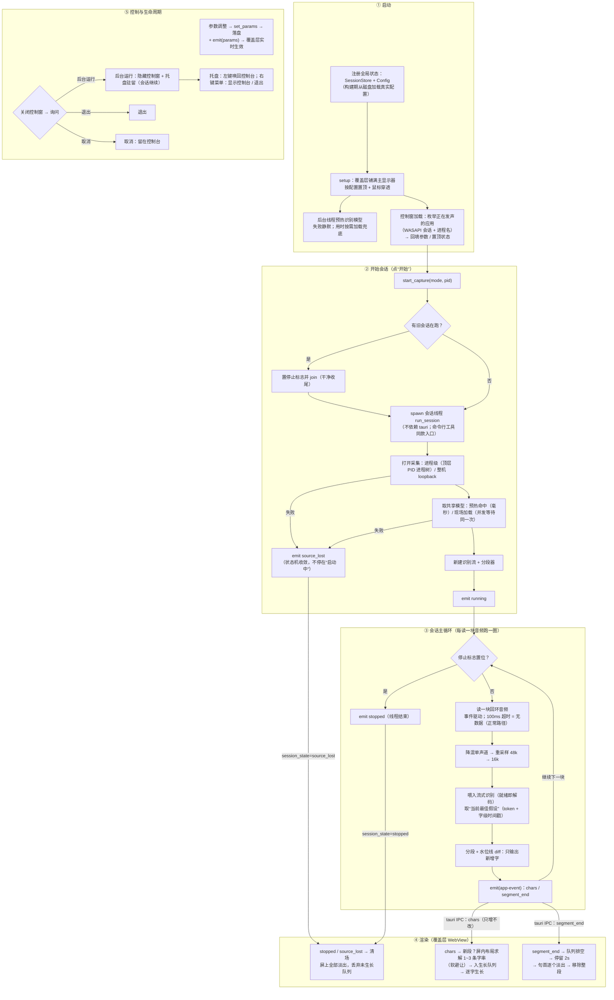

## 项目背景

做这个项目的动机有两个：**想学 Rust，也想学音频处理**。一直听说 Rust 和 Windows 底层开发很契合——官方 `windows-rs` 绑定、没有 GC 的实时性、编译期就把资源约束摆上台面——但光看文档感受不到，必须找一个合适的场景把它跑通；音频处理则是另一个一直想碰、但始终没找到好切入点的问题。

于是给自己定了一个具体的目标：**抓取本机某个应用（酷狗 / B 站）正在播放的音频，用本地离线模型实时识别成文字（中英双语、字级时间戳），再以《脑叶公司》/《废墟图书馆》的风格逐字渲染到整个屏幕上**——字串随机出现在屏幕各处、水平微倾、逐字生长、句首开始逐个淡出；覆盖层透明、置顶、鼠标点击穿透，不影响正常用电脑。

它恰好把想学的东西都串起来了：WASAPI 回环捕获与进程级捕获、COM 线程模型、PCM 与重采样、流式语音识别与字级时间戳，以及一条对实时性敏感的事件流与渲染链路。

技术选型上：

- **Rust + wasapi / windows-rs**：音频采集直接调 Windows 原生 API。COM 的线程约束、资源生命周期、错误处理，正好是感受 Rust 内存模型与类型系统的好素材；
- **sherpa-onnx 流式 zipformer**（中英双语 int8 模型）：识别引擎不自己训练——学习目标是"链路与音频工程"，模型训练是另一个领域；它纯 CPU 就能实时跑，完全离线、不联网、不花钱；
- **tauri v2 + 原生 JS/CSS**：渲染用 WebView，透明窗、置顶、鼠标穿透都是现成能力；动效用 CSS transform/opacity 写效率最高；前端保持纯静态文件，没有 npm、没有打包步骤；
- **不用云端识别 API**：音频不出本机（隐私）、零成本、离线可用——这正是"本地离线"的价值主张本身。

目标说得务实一点：**不追求功能大而全，而是把"从系统声音到屏幕上出现文字"这一条链路端到端做深**——捕获、重采样、识别、分段、动效，每一层都亲手跑通、都能独立验证。

还有一点要说清楚：**这个软件是纯玩的**——动机就是好奇心和好玩，不奔着产品化去，也不为解决什么实际问题。也正因为是纯玩，才有余裕把时间花在"每个环节亲手做一遍"上，而不是快速拼一个能跑的成品。

## 总体架构

整体是**三段式解耦**：采集 → 识别 → 渲染。单元之间只有一个契约——**只增不改的 `AppEvent` 事件流**（chars / segment_end / session_state）：

```
采集（专用线程，wasapi）
├─ 进程级：ActivateAudioInterfaceAsync + PROCESS_LOOPBACK
│    └─ 传入沿父链上溯的"顶层 PID"——按进程树覆盖整个应用
└─ 整机：默认输出设备 loopback（兜底模式）
   │  事件驱动读块，交错 f32
   ▼
重采样链：降混单声道 → 线性插值降采样（48kHz → 16kHz，f32）
   ▼
识别（同一会话线程内顺序循环）
├─ AsrShared：进程内共享模型（OnceLock 缓存 + 启动后台预热）
├─ 每次会话新建独立 OnlineStream，流式 zipformer 解码
│    └─ modified_beam_search 束搜索（束宽 4）+ endpoint 静音切句
└─ SegmentTracker：全量 token → 只增不改事件流
     ├─ 句内按标点切段 / 无标点 16 字上限强切
     └─ 水位线 diff：只发"新增字"，识别修正与回撤在层内消化
   │  tauri emit("app-event")
   ▼
渲染（覆盖层 WebView：全屏透明 / 置顶 / 鼠标穿透）
├─ layout.js：屏内布局求解（纯函数 + 种子随机，可单测）
└─ renderer.js：每段 1~3 条字串，逐字生长 → 停留 2s → 句首逐个淡出
```

事件契约就三个事件，字段名固定：

```json
{"type":"chars","segment":7,"chars":[{"text":"今","t0":1.23,"t1":1.41}]}
{"type":"segment_end","segment":7}
{"type":"session_state","state":"running"|"stopped"|"source_lost"}
```

完整软件流程（从启动到退出的全生命周期）：



几个设计亮点：**渲染层完全不理解语音**——它只消费事件流，因此可以用"假字流"独立调试和验收动效（无音频、无模型也能跑）；**识别层是唯一与"不确定性"打交道的地方**（流式识别结果会修正、会回撤），它负责把不稳定的中间态消化成稳定的事件流；采集层把两个后端（进程级 / 整机）藏在同一个 `ChunkReader` trait 后面，会话编排对具体后端无感知。

## 关键技术决策

**1. 进程级捕获：从"预选第三方库"到"上游原生 API"**

最初的设计预选了一个较新的第三方库（flexaudio-os-windows）做进程级回环，还专门设计了失败判定与退路。实现这一步时发现，上游 `wasapi` crate 已经原生封装了 `new_application_loopback_client`——正是微软官方 ApplicationLoopback 方案（`ActivateAudioInterfaceAsync` + `PROCESS_LOOPBACK`）的封装，于是少引入一个依赖、直接用原生 API 完成：

```rust
let root = top_level_pid(pid); // 沿父进程链上溯到顶层进程
let mut client = AudioClient::new_application_loopback_client(root, true)
    .context("open process loopback")?;
```

多进程应用（如浏览器：主进程 + 渲染进程 + 音频进程）要求传"顶层 PID"才能覆盖整个应用——`top_level_pid` 快照进程表、沿父链上溯（带防环上限），把"应用"当成一棵进程树而不是单个 PID。

**2. COM 的线程约束塑造了线程架构**

WASAPI 是 COM 接口，相关对象**非 Send**——Rust 编译器直接拒绝把它移出创建线程。这不是"注意一下"的问题，而是硬约束：所以采集、重采样、识别在同一个会话线程内顺序循环（读块 → 降混 → 重采样 → 喂模型 → 取结果 → 发事件），不跨线程传递任何 COM 对象；会话线程由 tauri 命令起停，通过原子标志停止。设计稿最初画的是"采集线程 → mpsc → 识别线程"，实现时合并为一个线程——更简单，也天然满足 COM 同线程约束。

另一个细节：wasapi 的错误类型是 `Box<dyn Error>`（非 Send + Sync），不能直接进 anyhow，统一转字符串错误——FFI 边界的类型"方言"要顺手翻译掉。

**3. 字级时间戳 + 增量 diff：把不确定性留在识别层**

流式识别的输出是"当前最佳假设"：随音频推进增长，也可能修正甚至回撤。但渲染层拿到的东西必须单调、只增不改——否则字串会闪现、闪烁、重排。决策是：**在 Rust 侧维护"已发送水位线"，只把公共前缀之后的新增字推给渲染层**；出现回撤时水位线不后退、静默等待追平。核心状态就三个游标：

```rust
pub struct SegmentTracker {
    next_id: u64,        // 段号自增
    active_start: usize, // 当前段在 token 序列中的起点
    sent_upto: usize,    // 已发出的 token 水位线（只前进）
    max_len: usize,      // 无标点时的强制切段长度（16 字）
}
```

切点规则还加了一个"尾部保护区"：切点后面必须至少还有一个 token 才允许切段——因为句子尾部恰恰是最可能被识别修正的部分，等一个 token 再切，避免把还在漂移的字发出去。代价是**已显示的错误字无法纠正**（回撤只影响内部游标）——这对"按氛围展示"的场景是可接受的取舍：脑叶公司风格本来就是"文字随机出现在屏幕各处、不保证按顺序阅读"，稳定性比纠正更重要。

**4. endpoint 静音切句：用引擎的"句读"，不自己写 VAD**

分段策略分三层：引擎 endpoint（尾静音触发整句终结）→ 句内标点切段 → 无标点 16 字上限强切。识别引擎的 endpoint 检测本质是"以静音为界的 VAD"（尾静音 2.4s / 1.2s 与最长 20s 三档规则），比自己在 PCM 上写能量检测可靠得多，还能配合引擎内部的流复位——一句话结束，识别状态清零，新句从头开始。

**5. 共享模型 + 预热：把 1~3 秒的加载藏进启动过程**

模型 190MB（int8），加载要 1~3 秒，常驻内存 200~400MB。如果每次点"开始"都重新加载，体验直接崩掉。方案是进程级共享缓存：

```rust
static SHARED_CACHE: OnceLock<Mutex<Option<(PathBuf, Arc<AsrShared>)>>> = OnceLock::new();
```

`get_or_load_shared` 缓存命中直接返回；**加载动作放在锁内**——预热期间用户点"开始"的并发调用会等待同一次加载，而不是触发第二次加载。应用启动时后台线程预热，于是点"开始"、切换监听对象都是毫秒级命中；每次会话只新建一个轻量的 `OnlineStream`。

**6. 渲染层：WebView + CSS 动画，布局求解是纯函数**

覆盖层要"全屏、透明、置顶、鼠标穿透、不抢焦点"，tauri 全部现成（`set_ignore_cursor_events` / skipTaskbar / focus: false）；动效用 CSS transform/opacity，60fps 没什么压力。真正需要设计的是**布局求解**：字串要"随机但完整落在屏幕内"——随机位置、随机方向（相对水平 ±30°）、整串 ±10~20° 倾斜、字间错落。解法是一个纯函数 `planSegments`：生成形状 → 尝试装进可用区（不行就收缩字号重掷）→ 把包围盒中心对准目标点再推回屏内 → 与屏上现存字串"软避让"（重叠比超 30% 重摇，最多 4 次，仍冲突则接受）。随机数用可种子的 mulberry32——**同一种子输出确定**，让布局可以写单测（10 个用例覆盖出界、避让、极端兜底）。每段文字生成 1~3 条字串，分布在视口随机切分的"带"里，避免全都堆在一侧。

## 踩坑记录

### 踩坑 1：静音切句永不触发——C 结构体的"零值默认"

**现象**：验证工具里把一段测试音频喂给识别引擎、再补 3 秒静音，期望触发句终结（`is_final: true`），但结果永远是 `false`——句子永远不结束。放到实时链路里表现为：字串不会整齐地"说完 → 停留 → 淡出"，而是只在同屏条数超限时被"挤掉"；跨句内容还会粘连在一起。

**排查**：对照 sherpa-onnx C++ 侧的默认值（尾静音 2.4s / 1.2s、最长语句 20s）逐一检查 Rust 侧配置，发现问题不在识别逻辑，而在配置结构体——三档 endpoint 规则阈值全是 0。

**根因**：sherpa-onnx 的 Rust 绑定暴露的是 C API 结构体，**默认是"全零"而不是"C++ 默认参数值"**：0 在语义上是"永不触发"，不是"用默认值"。这些阈值不会报错、不会警告，只会安静地什么都不做。

**修复**：显式设置三档阈值，并在代码里注释原因防止后人"清理"：

```rust
// C API 结构体默认全 0：规则阈值必须显式设置，否则 endpoint 永不触发
config.rule1_min_trailing_silence = 2.4;  // 2.4s 尾静音
config.rule2_min_trailing_silence = 1.2;  // 1.2s 尾静音（配合已解码出内容）
config.rule3_min_utterance_length = 20.0; // 最长 20s 强制切
```

修复后验证工具对测试 wav 正常输出 `is_final: true`，实时链路的"说完即淡出"节奏全部正常。

**教训**：跨 FFI 边界时，"默认值"这个概念要当成不存在——**结构体里每一个有语义的零值都必须显式赋值**，并写下注释解释为什么。

### 踩坑 2：首块捕获选错 PID——"应用"是一棵进程树

**现象**：进程级捕获选择浏览器（B 站网页播放）时，要么完全没声音，要么只能录到部分声音；换成音乐软件则正常。

**排查**：先怀疑捕获本身——用 `proc_probe` 工具打印样本量与峰值，能拿到数据流但很稀疏；对比"整机模式"一切正常，说明问题出在"选哪个 PID"而不是链路。回头查进程列表发现：浏览器是典型多进程架构，音频输出挂在哪个进程并不固定，而页面进程与它未必是直系关系。

**根因**：WASAPI 进程级 loopback 的"进程树"语义以传入 PID 为根计算——**传哪个 PID，就只覆盖那个 PID 及其后代**。而"用户看到的那个应用"往往不是单进程，而是共享同一可执行文件的一棵进程树；只传选中 PID（比如音频会话归属的某个子进程），兄弟/父进程的音频就漏掉了。

**修复**：打开捕获前先做一次进程快照（`CreateToolhelp32Snapshot`），沿父进程链上溯到顶层 PID（带 32 层防环上限），以顶层 PID 为根开捕获——整棵树都被覆盖：

```rust
let root = top_level_pid(pid); // 浏览器：主进程 + 渲染进程 + …全在里面
let client = AudioClient::new_application_loopback_client(root, true)?;
```

修复后同场景复测：只录到选定应用的声音，同时播放其他音源不会混入。

**教训**：Windows 上"一个应用"的粒度不是 PID，是进程树；涉及进程级资源（音频、窗口、句柄）时，先想清楚"谁才是根"。

### 踩坑 3：启动竞态——参数面板偶发读出默认值

**现象**：偶尔启动应用后，控制窗里显示的是**默认参数**而不是上次保存的参数（颜色、字号、条数等"回到出厂设置"），刷新或重启又可能正常。

**排查**：控制窗 JS 在页面加载时立即调用 `get_params`；而第一版实现里，配置状态是在 tauri 构建期先用 `Config::default()` 注册占位、`setup` 回调里才从磁盘加载并填充。**如果 WebView 的 JS 抢在 setup 之前调用命令，就会读到占位默认值**——一个典型的"先占位、后填充"初始化缝隙。

**根因**：配置路径当时依赖运行时的 app 句柄（`app_config_dir()`），所以只能等 setup 才能算出来——路径可计算的时间点被绑死在句柄上，状态就必然经历一段"未就绪期"。

**修复**：把配置路径改造为**不依赖句柄、构建前即可计算**（`APPDATA/{identifier}/config.json`），在构建期直接加载磁盘上的真实配置注册状态；setup 只做窗口配置。这样任何时刻读到的都是真实值，缝隙整体消失：

```rust
tauri::Builder::default()
    // 构建期即加载磁盘配置并注册：任何时刻读取到的都是真实值（无启动竞态）
    .manage(AppConfigState::new(Config::load(&default_config_path())))
```

**教训**：顺序敏感的全局状态，要么在"最早可计算"的时间点就绪，要么让消费者显式等待就绪——**不要留"先占位后填充"的缝**。它的表现形式（偶发读到默认值）和复现难度（时序相关）都极具迷惑性。

（同一个问题的兄弟版本：会话初始化失败时最初只返回 Err、不发状态事件，导致控制窗永远停在"启动中…"。修复后统一规定：**任何初始化失败也必须发 `source_lost`**，让订阅方状态机收敛。错误路径也要走状态机。）

### 踩坑 4：点"停止"之后，字还在继续冒出来

**现象**：点"停止"后，屏上现有的字串正常淡出了，但队列里还没生长的字仍在陆续冒出来——要"吐"完剩余队列才真正安静，视觉上像"停止没停干净"。

**排查**：渲染引擎的生长循环是 `setTimeout` 递归驱动（每个字一个定时器，节奏跟随语速）。停止时 `clearAll()` 只把屏上的段推进"淡出"流程，但已排队等待生长的字和 pending 的定时器没有被取消。

**根因**：异步动画系统里，"取消"最初只做了"视觉收尾"（屏上清场），没做"逻辑中止"（放弃队列、终止泵）。

**修复**：两道保险——生长泵的每一步先检查段状态，发现已进入消失/完成流程就直接放弃剩余队列；清场时清空队列、统一进入淡出：

```js
const step = () => {
  // 已进入消失流程（含停止清场）：放弃剩余队列
  if (seg.state === 'vanishing' || seg.state === 'done') { seg.pumping = false; return; }
  ...
};
```

修复后：停止 / 声音源断开瞬间，屏上所有字串统一进入清场淡出，不再有新字冒出。

**教训**：**动画系统的"取消路径"和正常路径是一等公民**——任何由定时器、递归驱动的异步链，都要能被从任意一点叫停。凡是"会自己继续跑"的状态机，先写清楚怎么停。

## 性能与效果

项目没有做严肃的吞吐压测（它不是一个服务，而是一个桌面实时应用），以下是设计目标与开发期的实测感知，口径尽量标注清楚：

| 指标 | 数值 | 口径 |
|---|---|---|
| 端到端延迟（声音→上屏） | 约 0.5~1.5s | 实测感知；流式块处理节奏 + 束搜索 |
| 模型加载 | 1~3s（后台预热） | int8 模型约 190MB；预热后点"开始"毫秒级 |
| 常驻内存 | 约 200~400MB | 模型常驻（共享缓存，多会话复用） |
| 识别算力 | 纯 CPU，无 GPU | int8 量化 + 束宽 4；目标 < 1 核 |
| 渲染 | 60fps | 全 CSS transform/opacity 动画 |
| 自动化测试 | 28 个用例全部通过 | Rust 18（分段 8 / 重采样 5 / 配置 3 / 事件契约 2）+ 布局 10 |

与"云端 ASR API"方案对比：精度上限不如大模型云端服务；换来的是**音频不出本机**（全部内存中流转，不录音、不落盘、不联网）、零成本、离线可用、可控延迟。与本地 Whisper 方案对比：Whisper 更准，但常规用法不是流式、块级延迟更大；本项目选流式 zipformer 就是为了"边说边出字"的实时感。

已知局限（都有明确方向，不是隐藏缺陷）：

- **唱歌识别率有限**——伴奏干扰是行业公认难点；说话类内容（视频、播客）效果明显更好；
- 已显示的错误字不会回撤（只增不改契约的代价，见决策 3）；
- 独占全屏程序上覆盖层不可见；只覆盖主显示器；
- 无麦克风输入（只做系统回环）；
- endpoint 切句与流式块处理决定了延迟下限，进一步优化需要换更小 chunk 的模型。

## 复盘与收获

**1. Rust 从"看懂语法"到"用约束思考架构"**

这个项目里 Rust 最有存在感的不是所有权语法，而是 **Send/Sync 约束直接参与了架构决策**：COM 对象非 Send，编译器逼着我把采集放进专用线程、不许跨线程传递——于是"单线程内顺序循环"的简单架构几乎是**被类型系统推出来的**；跨会话共享模型又用 `Arc + OnceLock + Mutex` 组合出"进程内单例、懒加载、并发等待同一次加载"的语义。还有 anyhow 的 context 链（错误在哪一层失败一目了然）、trait 对象做后端解耦（`Box<dyn ChunkReader>`）。写完这个项目再看"Rust 适合系统编程"，感受完全不同了——它不是"能写底层"，而是**它让底层的约束在编译期就浮出水面**。

**2. 音频处理的认知链条：PCM → 回环 → 重采样 → 端点**

以前觉得"音频"是个黑盒。做完之后，一条完整的认知链是：PCM 就是"采样率 / 声道 / 位深"三件事（交错存储、f32 [-1,1]）；WASAPI 共享模式回环 = 把输出设备的混音数据"再读一份"，进程级捕获则要求走微软的 `ActivateAudioInterfaceAsync` 激活流程（还撞上"必须显式 start、读缓冲必须容纳整包、100ms 超时无数据是正常路径"这些"新手坑"）；重采样没引库——手写线性插值，无跨块状态、块尾最多丢 2 个输入样本（48kHz 下约 0.04ms 音频，对识别无损），用"绝对简单可靠"换掉一个依赖；端点检测（endpoint）本质是"以静音为界的 VAD"，交给识别引擎做远比从 PCM 上自己算能量靠谱。听感上"停顿一下，句子才收尾"的行为，背后就是那几行阈值的物理意义。

**3. 事件流设计：把不确定性留在能处理它的层**

这是本项目最大的认知收获。流式识别的中间态是不稳定的（修正、回撤），但 UI 动画要求稳定和单调。解法不是"让识别更稳"，而是**在两层之间定义一个只增不改的契约**，把 diff、水位线、尾部保护这些"脏活"全部压在识别层内消化。结果是渲染层完全不需要理解语音，甚至可以脱离音频、被一段假字流驱动调试。**能用"契约"挡住的不确定性，就不要让它扩散**——这个思路在别的系统里同样成立。

**4. 工程方法论：可独立验证的链路 + 可复现的随机**

- **分层验证工具链**：每一步都有独立工具——`rec_test`（录 10s wav 验证采集）、`asr_wav`（wav → 文字 + 时间戳验证识别）、`live_test`（实时链路控制台逐字验证）、假字流（验证纯动效）。出问题时能立刻二分定位到某一层，而不是对着整个应用猜；
- **种子随机**："字串不出屏"这种视觉约束，靠 mulberry32 的"同种子输出确定"写成了断言；避让这种统计行为则用多种子对比统计来测；
- **错误路径也是状态机的一部分**：初始化失败必须发 `source_lost`（否则 UI 停在"启动中"）、停止必须能中止异步链（否则"停止"后字还在冒）——**每个能被启动的东西，都要有一个确定的"停止"语义**；
- **诚实的边界**：唱歌识别率、延迟下限、版权与准确性声明都写进 README——主动说清局限比藏着掖着可信。

**5. 后续方向**：多显示器全覆盖；麦克风输入；更丰富的动效模式（卡拉 OK 底部条等）；本地音乐文件的歌词对齐模式（LRC + 声学对齐）；更小的 chunk 模型 / GPU 推理进一步压低延迟；识别历史回看。
