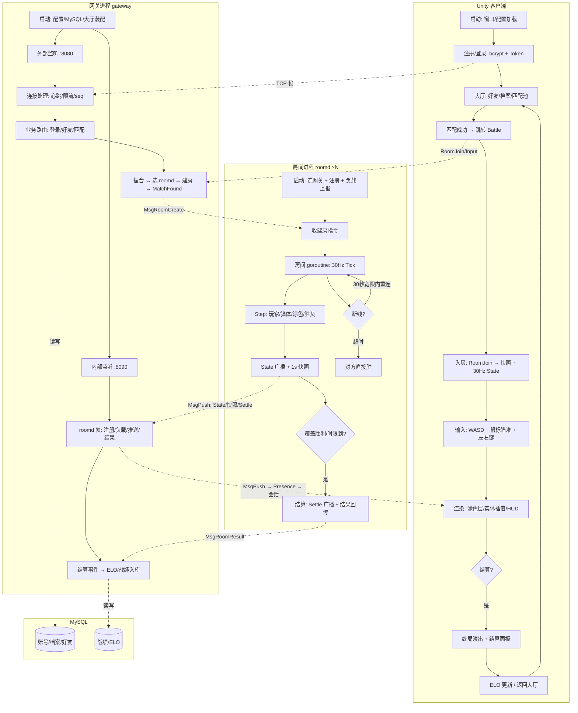

> 这是 SignalDrift 系列开发日志的第六篇，也是整个项目的收官篇。前五期按计划拆着写，这篇反过来——不写新功能，把整个项目摊开看一遍：架构、决策、问题、方法论，以及一张覆盖全链路的完整流程图。

写这篇的动机很简单：项目做完了，值得停下来回答三个问题——**它最后长什么样？我一路做了哪些关键决定？这些决定里有多少是被问题逼出来的？**前五期是过程记录，这篇是结果审视。所有数字、所有流程图节点、所有"教训"，都来自真实跑通的代码和真实踩过的坑，没有一处是事后补的想象。

## 项目长什么样

先看最终形态。四个进程/组件，两条网络通道：

```
Unity 客户端（Windows exe）──TCP 帧协议──> 网关进程 gateway ──内部 TCP──> 房间进程 roomd ×N
                                              │                              │
                                              └─────── MySQL ───────────────┘
                                    （账号/档案/好友/战绩/ELO）
```

各司其职：

| 组件 | 技术 | 职责 |
|---|---|---|
| Unity 客户端 | C# / URP 2D | 显示与输入——所有玩法规则都在服务端 |
| 网关 gateway | Go | 连接生命周期、登录/好友/匹配业务、roomd 调度 |
| 房间 roomd ×N | Go | 30Hz 对局模拟与同步、结算 |
| MySQL | — | 账号/档案/好友/战绩/ELO 持久化 |

网关管连接与业务，roomd 管对局，MySQL 管持久化，客户端只管显示与输入——**所有玩法规则都在服务端**，这是整个项目最重要的一条架构决定：客户端可以坏，对局不会作弊。

## 模块地图：代码长什么样

服务端按包分层，依赖方向从下往上单向：

```
server/
├── cmd/gateway            进程入口：装配大厅/转发/起服务/优雅关闭
├── cmd/roomd              进程入口：注册/读循环/负载上报/排空
└── internal/
    ├── config             配置加载与校验（server/lobby/roomd/battle/map 五套）
    ├── protocol           帧编解码（FrameReader 粘包拆包）+ 消息号 + 跨进程 JSON 契约
    ├── gateway            连接层：SessionManager/HeartbeatWatcher/IPLimiter/Router
    │                       + 转发层：RoomdRegistry（注册中心）/ForwardTable（UID 绑定）
    ├── lobby              大厅业务：Service/MatchPool/Presence/TokenIssuer/EventQueue
    ├── store              存储抽象：Store 接口 + MemStore/MySQLStore 双实现（语义一致）
    ├── battle             战斗核心（零网络零 IO 纯逻辑）：
    │                       config（数值）→ grid（格子/涂色/dirty/快照）
    │                       → painter（溅射/走廊）→ world（移动/踩色/墨量）
    │                       → projectile（双弹道/黑洞/反射）→ win（胜负）→ codec（二进制包）
    └── room               房间：Room（30Hz goroutine/输入槽/结算锁存）
                            + Manager（建房/热更 mtime/结果回传/断线分发）
```

几个值得展开的模块内部设计：

**store：一个接口，两个实现**。`Store` 接口十个方法（注册/登录/档案/好友/战绩/ELO），`MemStore` 给测试和冒烟用，`MySQLStore` 给生产用——语义完全一致（`ErrDuplicate`/`ErrNotFound` 哨兵错误对齐）。上层永远只依赖接口，换存储不动业务代码——这是"存储可替换"的标准做法。

**battle：六个文件一条流水线**。config 定义数值 → grid 管理格子状态 → painter 负责涂色形状（溅射圆/走廊）→ world 把玩家接进来（移动/碰撞/墨量）→ projectile 加弹道（直射/抛射/黑洞/反射）→ win 判定胜负。文件边界就是数据流边界：每一层只消费上一层的结构体，测试可以单测任意一层。

**room：一个房间一个 goroutine**。`Room` 持有世界、输入槽、结算锁存、占比历史；`Manager` 持有所有房间、处理建房/转发/热更。房间是**单写者**模型——只有一个 goroutine 碰世界，所以不需要锁（输入槽用互斥，世界本身无锁）。

客户端同样分层，但按"能不能碰引擎"切：

```
Assets/Scripts/
├── Net/Protocol       纯 C#：FrameCodec/BattleCodec/MsgId/DTO（noEngineReferences 强制无引擎）
├── Net                连接层：NetworkClient（后台线程+主线程泵）/MessageDispatcher
├── UI                 场景脚本：LoginController/LobbyController/BattleHud/SettlePanel
├── Game               战斗逻辑：BattleController（入房/输入/重连）/PaintRenderer（涂色）
│                       /EntityView（实体插值）/BattleContext（跨场景上下文）
├── Editor             编辑器工具：BattleSceneBuilder（一键生成静态层）/SwitchToDefaultFont
└── Tests              EditMode 测试（编解码 golden vector 对拍）
```

关键设计：**协议层在程序集层面禁止引擎引用**（编译期强制），所以编解码测试能脱离 Unity 运行；Game 层只依赖静态数据（BattleController 暴露只读视图），渲染层（Paint/Entity）从视图读数据——渲染与网络解耦，各自可测、可替换。

## 四个计划为什么这么拆

- **计划 1：网关**——先把"一个 TCP 连接怎么活着"讲清楚：12 字节二进制帧协议、心跳巡逻、IP 限流、seq 幂等过滤、优雅关闭三阶段。这是所有上层的地基——后面三个计划的通信全走它；
- **计划 2：大厅**——业务层：bcrypt 账号、HMAC Token、好友、ELO 近邻匹配池、异步结算队列。到这里，"两个玩家能匹配到一起"成立；
- **计划 3：Unity 客户端**——协议层纯 C# 编解码（程序集强制）、连接单例、登录/大厅场景。到这里，"玩家能走进大厅点匹配"成立；
- **计划 4：房间对战**——确定性战斗模拟库、独立 roomd 进程、30Hz 增量同步、客户端涂色渲染与结算面板。到这里，"两个玩家能真正打一局"成立。

每一步的验收都是可玩的：计划 1 用命令行客户端收发心跳，计划 2 用冒烟脚本跑通注册到匹配，计划 3 第一次看到登录界面连上服务器，计划 4 第一次和朋友异地打完一整局。**每层完成时都有一件"真实跑通"的事**，而不是一堆代码堆在仓库里。

## 协议：一条贯穿全局的线

从计划 1 到计划 4，所有通信都走同一套帧协议：12 字节头 + body，大端序。头的四个字段各司其职：`magic`（0x5344）验协议、`msgID` 路由、`seq` 幂等防重放、`bodyLen` 限长（64KB）。消息号按域分区：1-99 网关、100-199 测试、200-299 大厅、300-349 战斗、400-449 网关↔roomd 内部。

一条线串起三个进程、两个语言、四层功能，换来的是**协议学习成本只付一次**：Go 端写一次编解码，C# 端镜像一份，双端用 golden vector 对拍钉死一致性。格式按场景选：战斗包体用二进制（涂色数据量大，JSON 不可接受），业务消息用 JSON（可读、好调试）——同一套帧，两种 body，各取所长。

## 服务端三层

**网关**：每连接两个 goroutine（读循环 + 写队列），心跳 5 秒一次、15 秒超时巡逻踢死连接，IP 令牌桶限流，seq 幂等过滤，优雅关闭三阶段（停匹配 → 关监听 → 排空队列）。连接层最怕的不是慢，是**半死**——连接还挂着、消息不再来，所以一切都围绕"如何识别并清理半死连接"设计：心跳是探测器，限流是闸门，seq 是防重放，关闭是排空。

**大厅**：bcrypt 存密码（统一 403 不泄露账号是否存在）、HMAC Token（先验身份再信任内容，过期严格大于才有效）、匹配池（ELO 近邻 + 30 秒内逐级放宽差值）、异步结算队列（单 worker 串行读档案、算 ELO、写库、推推送——**结算绝不在对局进程里碰数据库**）。业务层最重要的是**权威**：所有校验在服务端，客户端只是提交意图。

**房间**：独立进程里的 30Hz 循环。确定性模拟库（注入随机数与时钟，同 seed 同输入世界完全一致）+ 增量同步（脏格子打包）+ 定期快照（1 秒全量校准，丢包自愈）+ 断线重连（30 秒宽限判负）。对局层的核心矛盾是**实时与正确的平衡**：增量给实时，快照给正确，缺一不可。

## 客户端四层

协议层（纯 C# 编解码，程序集 `noEngineReferences` 强制不许碰 UnityEngine——约束写进编译器，不是写在注释里）→ 连接层（后台线程只入队、主线程 Update 泵分发）→ 业务层（登录/大厅/战斗控制器，30Hz 输入流、断线自动重连）→ 表现层（涂色贴图、实体插值、HUD、结算面板）。

客户端最大的架构约束是 Unity 的单线程模型：**后台线程只做收发，一切业务在 Update 泵里执行**——线程边界只有一条队列，规矩只有一条"后台不碰 UI"。协议层与渲染隔离带来的额外好处是：编解码可以在纯 C# 环境里跑单元测试，和 Go 端做逐字节对拍，不依赖 Unity 运行时的任何东西。

## 完完整整的全流程图

下面这张图覆盖从客户端启动到 ELO 入库的整条链路——每个节点都来自真实跑通的代码：



## 数字盘点

- **消息号分区**：网关/测试/大厅/战斗/内部五个分区，全部大端；战斗状态包含玩家/弹体/覆盖率/脏格子，快照 RLE 压缩；
- **服务端**：约三十个 Go 文件，六个包；单元测试六十多个，`-race` 全绿是每个任务的硬门槛；
- **客户端**：编解码 golden vector 对拍测试、连接单例、三个场景、四个战斗 UI 组件、Editor 静态层生成工具；
- **压测**：192 房间满载 11520 包/秒零丢失；网关纯吞吐峰值 188k 帧/秒；冒烟脚本 + 满载压测脚本留存可复跑；
- **真实问题**：开发过程中修复的确定性问题超过十五个（下节分类），每一个都留下了根因与修复记录。

## 问题全景：十五个真实 bug 的分类

| 类别 | 代表问题 | 共性 |
|---|---|---|
| **并发缺陷** | 结算重复计分 300 次、Online 数据竞争、令牌桶共享 | 单线程测试全绿掩盖——要按生产场景推演 |
| **生命周期** | 网关 Stop 死锁、roomd 崩溃瘫痪匹配、幽灵房间、变量遮蔽 | 第一次被真实触发才暴露 |
| **满载边界** | MarkFull 死循环、假房号 | 正常负载永远看不到，压测满载才现形 |
| **Unity 坑** | Awake 竞态、LineRenderer 坐标、PPU 尺寸、内置资源失效、Input System 换代、名字竞态、自锁输入 | 框架特有的隐性约定 |
| **同步设计** | 增量丢包永久缺失 | 实时与正确要双轨 |

回头看，这些问题的共同规律是：**它们都藏在"测试没覆盖的那个角落"**——要么需要并发，要么需要特定时刻，要么需要满载，要么需要真实用户操作。这也是为什么这个项目坚持了三件事：任务级代码审查、满载压测、真实双人联机验收。

## 方法论沉淀

写代码之外，这个项目还沉淀了一套**计划驱动的开发流程**：每个计划先写成任务清单（每任务含接口签名、失败测试样例、验收标准），按任务逐个 TDD 实现；每完成一个任务，审查者按"生产场景"推演一遍；过程记录在 ledger（进度、提交 hash、问题根因），中途丢上下文也能从 ledger 恢复。这套流程的价值在计划 4 体现得最充分——十三个任务、几十次审查、十五个问题，没有一次"做完才发现方向错了"。

- **TDD + 任务审查**：每个任务先写失败测试再实现，每完成一个任务让审查者按"生产场景"推演——抓出的问题比测试多（结算重复计分、Stop 死锁都是审查抓的）；
- **确定性模拟库**：随机数、时钟注入，让玩法规则可逐字节复现——测试敢用精确数值断言，而不是"大概在范围内"；
- **双端对拍**：跨语言协议用真实输出钉字面量，"不能自证"——Go 跑出来的 RLE hex 直接进 C# 测试；
- **增量 + 快照**：实时靠增量，正确靠快照，两者相加才是完整同步——单靠任何一个都会失败；
- **压测在满载边界跑**：正常负载下不会暴露的问题（满载死循环、假房号），满载时全部现形；
- **每层一个"真实跑通"的验收**：命令行收发、冒烟脚本、登录界面、朋友的一局对战——每层都有一件"不是测试而是真的能用"的事。

还有两个贯穿全程的"止损决策"，也值得记：**中文字体**（动态字体图集满缺字、资产重建引用悬空，折腾数轮后英文 UI + 自带字体止损，中文方案留待接入现成字体包）和**外部配置**（连接参数放 StreamingAssets，打包后可改——后来异地联机就是靠它，朋友改一行 host 就能连进来，不需要重新打包）。

## 里程碑时刻

这个项目最值得记的时刻不是任何一次测试通过，而是最后那个晚上：**和一个朋友异地打了一整局**——他改一行配置文件，登录进来，匹配，对战，结算，ELO 变化。那一刻所有计划、所有 bug、所有深夜调参都有了答案：**它是一个能玩的游戏**。

## 下一步

项目本身已经完整：计划 1-4 全闭环，双人可玩。可选的方向是计划 5：Bot 与观战（单人可玩与自动演示）、Prometheus 监控（工程可见度）、Docker 一键部署（面试演示包）。如果这些都做了，这个项目就从"能玩的游戏"变成"能展示的工程"。

## 结尾

六篇日志，四个计划，一个从空仓库到双人对战的项目。如果只留一句话给后来者：**把每一层做到"真实跑通"，把每一个问题追到根因，把每一次验证放到真实场景**——练手项目的上限，取决于你用多真的标准要求它。
